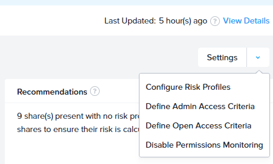
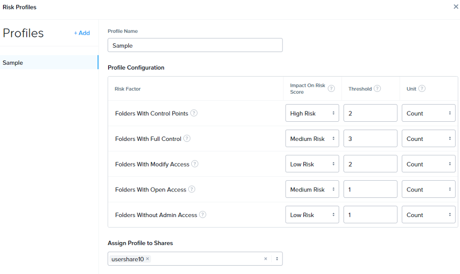
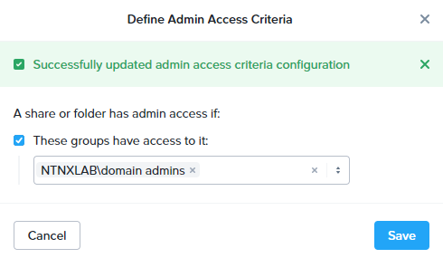
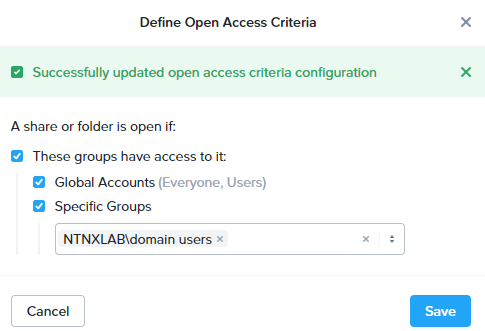
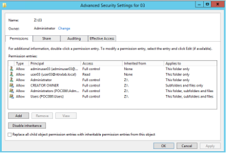
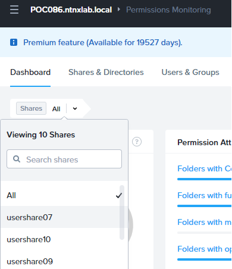
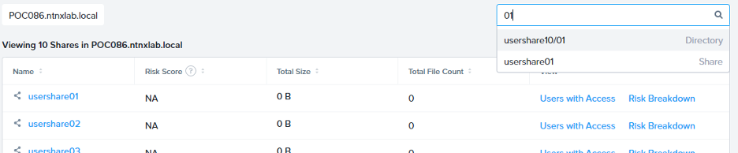
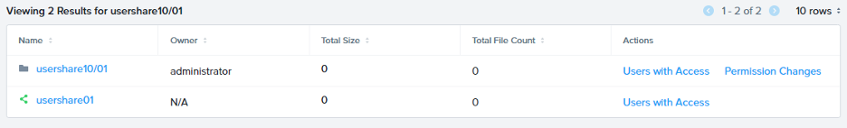
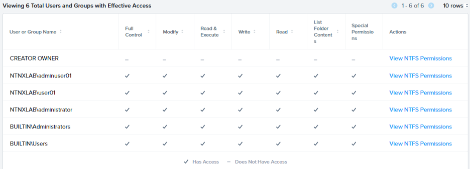

# Data Lens - Permission Monitoring

## Background

Starting with Data Lens Sept 2023 release, Data Lens provides features to monitor:

- Permissions for shares and directories 
- Permissions for user and group level to identify sources access control
- Monitor source of risk using risk score trend analysis to identify data and user vulnerabilities.

## Lab
In this lab you will be able to see how permission monitoring can be setup and how to find out which folders are in high risks to access control.

## Permission Monitoring from Data Lens

1.	Connect to corp VPN, select the gateway without (ST)
2.	Go to https://datalens-qa.nutanix.com/
3.	Login information will be provided in lab lookup tool
4.	Choose **Common Tenant** and then **Proceed**.
5.	In the Data Lens Global Dashboard, go to File Servers and search the FQDN of your File Server Name (POCxyz-#.ntnxlab.local). Click the name to enter the Data Lens of the particular File Server.
6.	From the pulldown list on the top left corner, click “Permission Monitoring”. Or you can click “Go to Permission Dashboard” from the Permission Monitoring tag in the Dashboard page.

### Create Risk Profile

1.	In Permission Monitoring, click Settings from the right side, then Configure Risk Profiles
     
2.	Click **+ Add**to add a new profile.
3.	Give a Profile Name as **UserYY-Profile**
4.	In Profile Configuration, there are 5 Risk Factor you can config. you can define your own risk score (High / Medium / Low Risk)
5.	Set all **Threshold** to be 1 and **Unit** as Count
6.	In Assign Profile to Shares, choose **usershareYY** where YY is your assigned user number
7. Click **Save**
    

### Define Admin Access & Open Access Criteria

1.	You can define the default admin group which is used to determine if a folder has the default admin access.
2.	In Data Lens > your File Server > Permission Monitoring > Settings, click Define Admin Access Criteria
3.	Tick to select These Groups have access to it:, and add GroupYY in it where YY is your assigned user number. And then click Save.
Reminder : Do not remove other groups in the list.
4.	Close the box by click the cross icon
     

5.	Now you can define open access by adding open access groups.
6.	Click **Settings** again, then click Define Open Access Criteria
7.	Tick to select **Specific Group**, and then put Domain Users as the group.
8.	Close the box by click the cross icon.
     

### Create Folders & Permissions

1.	Login to your WinTools via RDP

2.	Map the **usershareYY** drive

3. Create at least 5 folders, you can also try to create some sub-folders to test the permission monitoring

    !!!note

          To test the five risk factors in Data Lens, set the folder permissions that match the following criteria:

          - Folders with control points - folders with non-inherited permission
          - Folders with full control - folders with full control permissions to some users/groups
          - Folders with modify access - folder with modify permissions to some users/groups
          - Folders with open access - folders accessible by a wide number of users/groups
          - Folders without admin access - folders without access to configure admin groups

    !!!info

          To change permission of the folders n your WinToolsVM, right click on **Properties > Security**

          If existing permission needs to be removed, disable inheritance.

          Go to **Properties > Security > Advanced > Disable inheritance**

          Choose to keep the existing permission or **remove all** and **add** again

          

### Verify the result in Data Lens

1.	Go back to **Data Lens > Permission Monitoring**
2.	It would take a few minutes for Data Lens learn of the permission changes
3.	Click **Share All**, and select your share
    
     
    
4.	Refresh to see the **Share Risk Score, Risk Details and Recommendations**.
5.	You can change the permission and see how that will impact the score.

### View Permission Details
1.	Go to Data Lens > your File Server > Permission Monitoring
2.	From the top, click Shares & Directories, you will see the list of shares in the file server with the risk score.
3.	Click Risk Breakdown, you will see the detail score of how the score is calculated, after viewing, click Close.
4.	On the top right search bar, key in one of the folder you created, and select it
     
5.	From the result table, click Users with Access of the folder path
     
6.	It will show the permission details, also click **View NTFS Permissions** of each user / group to see the detail permission rights
     
7.	Click the :octicons-x-16: icon on the top right corner to exit this page.
Next to the folder, click **Permission Changes**
     
 
9.	Find the last latest permission change record and click View Details
10.	The changes that was done before will be shown here, verify if that is what you have done
     
11.	Go back to Permission Monitoring, from the top, click Users & Groups, you will see the list of groups or users with the permission details.
12.	You can click Effective Access and All Permissions for group / user to see the permission list of them.

##Takeaways

With Permission monitoring, customers can see the full details of SMB permission per users & groups, and per shares & directories. Data Lens also gather the permission information and analyses the risk exposure of the shares and folders according to the scoring criteria. Customers will be able to see the highest risk shares or directories and mitigate the risk with Data Lens recommendations.

