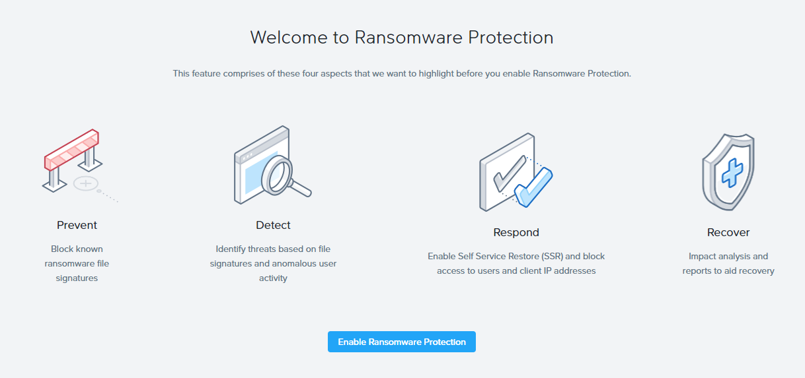
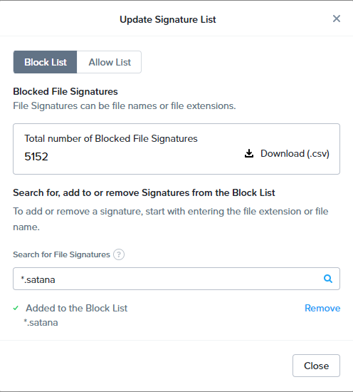
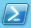
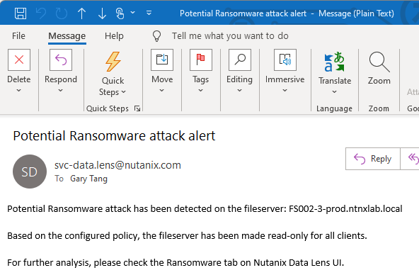

# Data Lens - Ransomware Protection

## Overview
One of the core capability of Data Lens is the enhanced ransomware protection. Data Lens maintains a list of blocked signatures of file name or extension patterns of known ransomware variants and automatically applys the list to
your file servers. An attack is prevented by locking the files
when file extensions match with the blocked signature list.

Moreover, the activity is bubbled into ransomware vulnerability dashboard reporting the client, user and the files impacted. In case of an attack, Data Lens performs remediation by blocking clients that trigger the attack or set the File Server to read-only mode. It will also track the infected files and recommend the best snapshot to recover the data.

## Lab Setup

In this lab, we will simulate a ransomware attack and verify how remediation works in Data Lens. 

## Login to Data Lens (if you are not already there)

1. Connect to corp VPN, select the gateway without **(ST)**
   
2. Go to https://datalens-qa.nutanix.com/ 
   
3. Your instructor will give you a my portal account to login
   
4. Choose **Common Tenant** and then **Proceed**.
   
      

5. In the **Data Lens Global Dashboard**, go to **File Servers** and search the FQDN of your File Server Name (**FSxyz-a-prod**).

      

    !!!note 
           Your File Server is already added and enabled to the Data Lens Dashboard. Contact lab instructor if you cannot find it.


6. Click the File Server Name to enter the Dashboard.

## Enable Ransomware Protection in Data Lens

1.    Click on :fontawesome-solid-bars: > **Ransonware Protection**

2.    If **Ransomware Protection** is not enabled, click **Enable Ransomware Protection**
      

3.    If **Ransomware Protection** is enabled, go to **Settings** > **Edit Policy Configuration**

4.    From **Detech and Act on Ransomware Threats**, select **Make File Server Read-Only**. Put your email address in **Email Recipients**, then **Enable**.
      

## Ransomware Protection Simulation

1.    Go to **Settings** > **Update Signature List**, search for ***.satana** in the search box. If it is not in the signature list, click **Add** to add it, otherwise just click **Close**.
            

2.    Login to **WinToolsVM** using username : **administrator@ntnxlab.local**

3.    Right click the **Powershell Icon**  and select **Run as Administrator**.

4.    Check the following 2 shares in **File Explorer**, you will see the same set of files in the 2 shares. We will use these 2 shares to compare the result with and without Data Lens ransomware protection.
      - **\\FSxyz-a-prod.ntnxlab.local\DLtest-prod\\**
      - **\\FSxyz-a-dr.ntnxlab.local\DLtest-dr\\**
  
5.    Run the script, which has some file creation and changing file type to both shares.
            ```bash
                  C:\Users\Administrator\Downloads\ransomware-test.ps1
            ```

6.    Check the share **\\FSxyz-a-prod.ntnxlab.local\DLtest-prod\\**, you can see all files are .txt, meaning Data Lens is protecting against the operation. Check **\\FSxyz-a-dr.ntnxlab.local\DLtest-dr\\**, you will see files were created and modified without Data Lens' protection.

7.    Wait until you receive email about ransomware attack alert.
            

            !!!note
                  It may take up to 15 minutes to receive this email. You can proceed to other labs while you are waiting.

8.    Go back to **Data Lens** > **FSxyz-a-prod.ntnxlab.local** > :fontawesome-solid-bars: > **Ransomware Protection**, you can see the threats are recorded and the File Server is set to Read-Only mode automatically.
            

10.   Login to your WinToolsVM and go to **\\FSxyz-a-prod.ntnxlab.local\DLtest-prod\\** from File Explorer, try to create a folder, it will show access denied as Data Lens set it to read-only.
            

            !!!note
                  Data Lens set the whole File Server to Read-Only mode. So you can use any other users to test on any shares in the same File Server. It should give you the same result.


11.   Go back to **Data Lens** > **FSxyz-a-prod.ntnxlab.local** > :fontawesome-solid-bars: > **Ransomware Protection**. Under **Blocked Entities**, click **Unblock** > **Confirm** to resume to read-write access.

            !!!note
                  You can always click the green circle  to check the status of the tasks.

12.   Come back to **Data Lens** sometimes later to check if it is done. Verify the access from your **WinToolsVM**.
