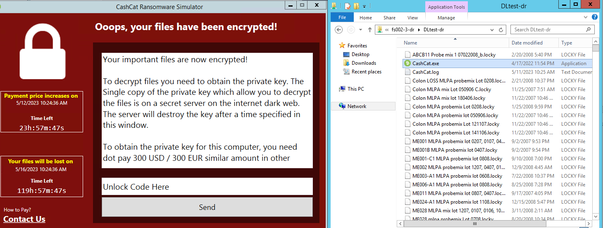

# Data Lens - Ransomware Protection

## Overview

## Lab Setup

In this lab, we will simulate a ransomware attack using a ransomware simulator. The simulator is called CashCat, is an open source simulator published on GitHub. You may find more information from <https://github.com/leeberg/CashCatRansomwareSimulator>

## Login to Data Lens (if you are not already there)

1. Connect to corp VPN, select the gateway without **(ST)**
   
2. Go to https://datalens-qa.nutanix.com/ 
   
3. Your instructor will give you a my portal account to login
   
4. Choose **Common Tenant** and then **Proceed**.
   
      

5. In the **Data Lens Global Dashboard**, go to **File Servers** and search the FQDN of your File Server Name (**FSxyz-a-prod**).

      

    !!!note 
           Your File Server is already added and enabled to the Data Lens Dashboard. Contact lab instructor if you cannot find it.

6. Click the File Server Name to enter the Dashboard.

## Enable Ransomware Protection in Data Lens

1.    Click on :fontawesome-solid-bars: > **Ransonware Protection**

2.    If **Ransomware Protection** is not enabled, click **Enable Ransomware Protection**
      

3.    If **Ransomware Protection** is enabled, go to **Settings** > **Edit Policy Configuration**

4.    From **Detech and Act on Ransomware Threats**, select **Make File Server Read-Only**. Put your email address in **Email Recipients**, then **Enable**.
      

## Ransomware Protection Simulation

1.    Go to **Settings** > **Update Signature List**, search for ***.satana** in the search box. If it is not in the signature list, click **Add** to add it, otherwise just click **Close**.
            

2.    Login to **WinToolsVM** using username : **administrator@ntnxlab.local**

3.    Check the following 2 shares in **File Explorer**, you will see the same set of files in the 2 shares. We will use these 2 shares to compare the result with and without Data Lens ransomware protection.
      - **\\FSxyz-a-prod.ntnxlab.local\DLtest-prod\\**
      - **\\FSxyz-a-dr.ntnxlab.local\DLtest-dr\\**

4.    In **\\FSxyz-a-dr.ntnxlab.local\DLtest-dr\\**, double click **CashCat.exe**. It will start the ransomware simulator.

5.    You will see the Simulator GUI pop up to ask for ransom, and all the .txt files got encrypted to another file type. Meaning attack was successful.
            

6.    Now do the same for **\\FSxyz-a-prod.ntnxlab.local\DLtest-prod\\**, double click **CashCat.exe**. 

7.    This time the Simulator GUI pop up again but you can notice that the .txt files were not encrypted. Meaning **Data Lens successfully blocked the attack!**
            

8.    