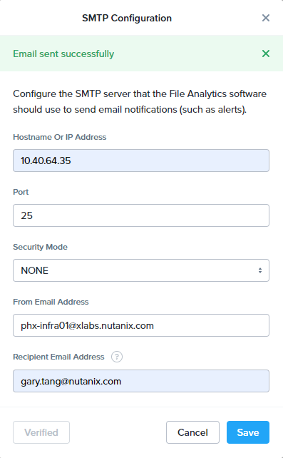

# File Analytics - Anomaly Detection

## Overview

One of the major features that Data Lens have is the ability to identify abnormal behavior. It gives administrators a way to monitor analytics data for potential threats such as mass file deletion or perimission changes. When anomalies are detected based on administrator defined policies, alerts are sent to warn the administrator of the threat.

In this exercise you will create anomaly rules and trigger events against the rules.

## Login to File Analytics (If you are not already there)

1.  Login to **Prism Element** \> **File Server** \> click the File Server **FS*XYZ*-#-prod** > **File Analytics**

    

## Define Anomaly Rules

1.  Create two anomaly rules by going to  > **Define Anomaly Rules** 

    

2.  Click **Configure SMTP to add recipients**, then fill in the following settings:
    -   **Hostname Or IP Address**: 10.40.64.35
    -   **Port**: 25
    -   **Security Mode**: NONE
    -   **From Email Address**: phx-infra01@xlabs.nutanix.com
    -   **Recipient Email Address**: [your email address]

    

3.  Click **Test** then **Save**.

4.  Go to  > **Define Anomaly Rules** again

5.  Create the first rule with the following settings:

    -   **Events:**: Delete
    -   **Minimum Operation %:**: 1
    -   **Minimum Operation Count:**: 1
    -   **User:**: All Users
    -   **Type:**: Hourly
    -   **Interval:**: 1

6.  Choose **Save** for that anomaly table entry

7.  Choose **+ Configure new anomaly** and create a second rule with the
    following settings

    -   **Events**: Create
    -   **Minimum Operation %**: 1
    -   **Minimum Operation Count**: 1
    -   **User**: All Users
    -   **Type**: Hourly
    -   **Interval**: 1

8.  Choose **Save** for that anomaly table entry

    

9.  Select **Save** to exit the Define Anomaly Rules window

## Load Sample Data

1.  Go to the folder **usershareXX** and copy and paste all the files and folders in the same share.

    

2.  Now delete the copied files.

## Cause Error Condition

1.  While waiting for the Anomaly Alerts to populate we'll create a
    permission denial.

    The Anomaly engine runs every 30 minutes. While this setting is
    configurable from the File Analytics VM, modifying this variable is
    outside the scope of this lab.
    :::

2.  Create a new directory called **RO** in the same share

3.  Create a text file in the **RO** directory with some text like
    "hello world" called **myfile.txt**

4.  Go to the **Properties** of the **RO** folder and select the
    Security tab

5.  Select **Advanced**

6.  Choose **Disable inheritance** and select the **Convert...** option

7.  Then add the **Everyone** permissions with the following:

    -   Read & Execute
    -   List folder contents
    -   Read

    

8.  Choose **OK**, **OK** and **OK** again

9.  Open a PowerShell window as a specific user

    -   Hold down **Shift** and **right click** on the **PowerShell
        icon** on the taskbar
    -   Select **Run as different user**

    

10. Enter the following

    -   **User name**: devuser01
    -   **Password**: nutanix/4u

11. Change Directories into the share share and the **RO** directory

    ```bash
        cd \\FSXYZ-#-prod.ntnxlab.local\usershareXX\RO
    ```

12. Execute the following commands, the first should succeed, the second
    should fail:

    ``` bash
        more .\myfile.txt
        rm .\myfile.txt
    ```

    

13. After a minute or so you should see **Permission Denials** in both
    the dashboard and the **Audit Trails** view. You may need to refresh
    your browser.

    

14. You can try different operations in the share and check the audit trail in File Analytics.