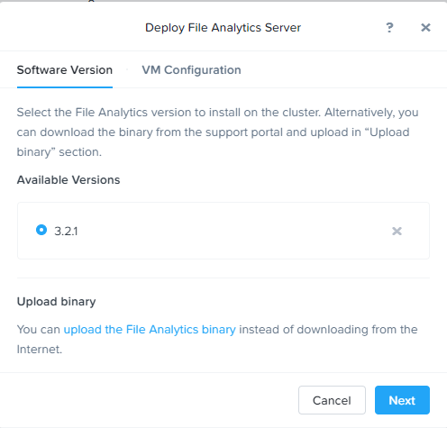
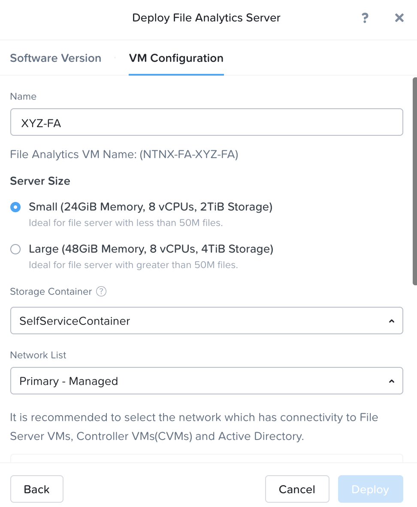

# File Analytics: Deploy {#file_analytics_deploy}

## Overview

In this exercise you will walk through deploying the File Analytics VM
and scan the existing shares to build out the dashboard. You will also
create anomaly alerts and view the audit details for your file server
instance.

::: note
::: title
Note
:::

If you are using HPOC/Single Node POC cluster, Files Analytics VM is
already deployed for you based on the staging.
:::

## Deploy File Analytics

1.  In **Prism** \> **File Server** \> click **Deploy File Analytics**

    

2.  Choose the Files Analytics latest software.

    For the purpose of saving time, the File Analytics 3.0 (or latest)
    package has already been uploaded to your cluster. Files binaries
    can be downloaded from the Nutanix Portal and uploaded manually.

    

3.  Click **Next**

4.  Input the following details:

    -   **Name** - *Intials*-FA
    -   **Server Size** - Small (can be Small or Large based on the
        number of files)
    -   **Storage Container** - Self Service Container
    -   **Network** - Primary-Managed

    

5.  Select **Show Advanced Settings**

6.  Ensure **DNS Resolver IP** is set to your Active Directory,
    ntnxlab.local, domain controller/DNS IP address and **ONLY** that
    address.

7.  Choose **Deploy**

8.  You can monitor the deployment from the **Tasks** page. The
    Analytics VM deployment should take \~5 minutes.

9.  Once deployed, In **Prism** \> **File Server**

10. Select your file server *Initials*-Files (e.g. XYZ-Files) for which
    you would like enable analytics and click **File Analytics**

    

    This will open in a new tab.

11. On the Enable File Analytic, choose the audit data retention period
    and the following credentials

    -   Active Directory Realm Name - ntnxlab.local
    -   User Name - <administrator@ntnxlab.local>
    -   Password - nutanix/4u

12. Click on **Enable**

    

You have now successfully deployed Files Analytics VM and setup
analytics for your files server *Initials*-Files.
