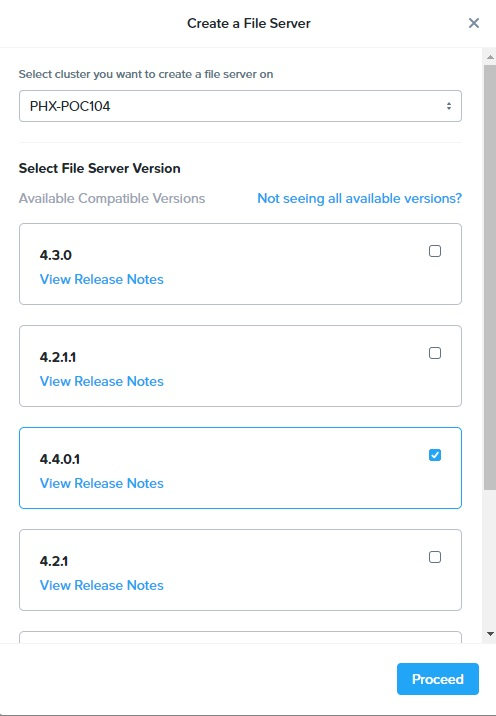
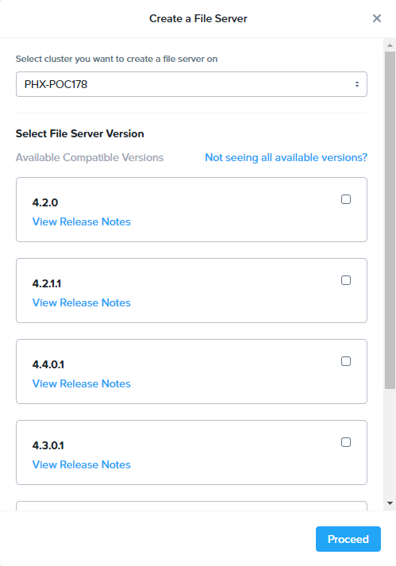
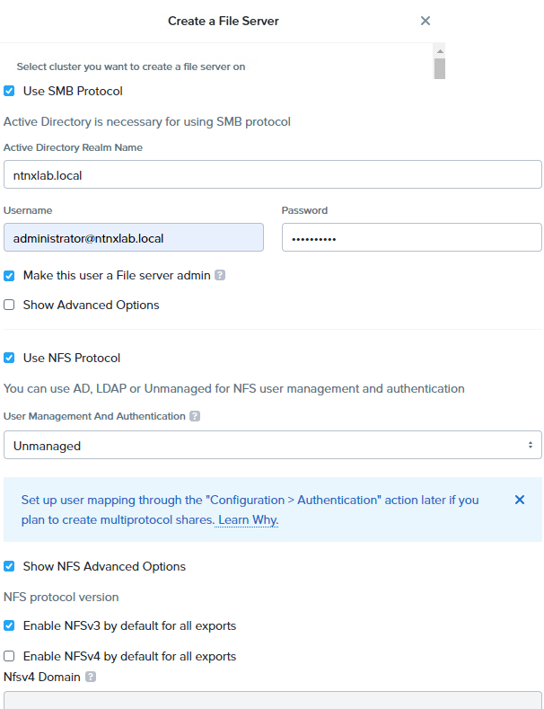
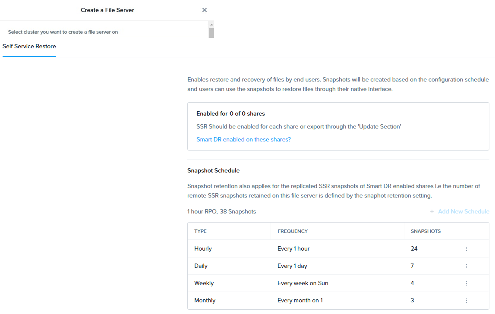

# Files: Deploy

## Deploy Files

1.  In **Prism Central > Files**, click **+ File Server** to open the
    **Create File Server** dialogue.

    !!!note

           Before deploying File Server in PC, you need to go to LCM to **perform inventory** one time to get the latest version of File Server in PC.

2.  Select your cluster and 4.4.0.1 as the File Server Version, then click **Proceed**.
      

3.  Fill out the following fields:

    -   FS*XYZ*-*A*-dr (e.g. FS002-3-dr)
    -   **Domain** - ntnxlab.local
    -   **File Server Size** - 1 TiB

    

4.  Click **Next**.

5.  Select the **Primary - Managed** VLAN for the **Client Network**.
    
    Each Files VM will consume a single IP on the client network.

    ???info "Check here for ESXi Hypervisor information"
           As this is an AHV managed network, configuration of individual IPs
           is not necessary. In an ESXi environment, or using an unmanaged AHV
           network, you would specify the network details and available IPs as
           shown below.
       
           
    
7.  Click **Next**.

8.  Select the **Primary - Managed** VLAN for the Storage Network.

    Each Files VM will consume a single IP on the storage network, plus 1 additional IP for the cluster.

9.  Click **Next**.

10. Leave the DNS servers and NTP servers as default and click **Next**.

11. Check the configuration again and click **Create** to start deploying a File Server.

    !!!note
    
           PC deployed File Server do not support PD based replication and snapshot, so we do not need to set PD snapshot schedule.

12. After the file server is created, click the name from **PC > Files > File Servers** to go to the file management console.

13. Go to **Configuration > Authenication**
14. Click **Use SMB Protocol** and fill out the following fields:

    -   Select **Use SMB Protocol**
    -   **Username** - <administrator@ntnxlab.local>
    -   **Password** - nutanix/4u
    -   Select **Make this user a File Server admin**

15. Click **Use NFS Protocol**
    -   **User Management and Authentication** - Unmanaged
    -   Select **Show NFS Advanced Options**
    -   Click **Enable NFSv3 by default for all exports**

    

    !!!info

            In un-managed mode, users are only identified by UID/GID. 

16.  Click **Update**.

17. Go to **Data Management > Protection** and then **Self Service Restore**
    
    

18. Observe the default Self Service Restore schedules, this feature controls the snapshot schedule for Windows\' Previous Versions functionality. Supporting Previous Versions allows end users to roll back changes to files without engaging storage or backup administrators. Note these local snapshots do not protect the file server cluster from local failures and that replication of the entire file server cluster can be performed to remote Nutanix clusters.

## Takeaways

What are the key things you should know about **Nutanix Files**?

-   Files can be rapidly deployed on top of existing Nutanix clusters,
    providing SMB and NFS storage for user shares, home directories,
    departmental shares, applications, and any other general purpose
    file storage needs.
-   Files is not a point solution. VM, File, Block, and Object storage
    can all be delivered by the same platform using the same management
    tools, reducing complexity and management silos.
