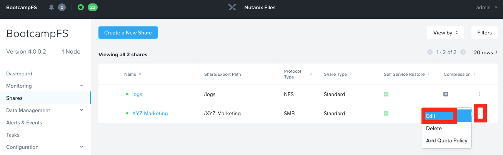

# Files: File Blocking {#files_file_blocking}

## Selective File Blocking

In this exercise you will configure Files to block specific file
extensions for the file server and the Marketing share.

1.  In **Prism Element > File Server**, select your file server and
    click **Launch Files Console**.

2.  The **Files Console** will open in a new browser tab

3.  Click on **Configuration > Authentication**

4.  Under **Blocked File Types** enter a comma separated list of
    extensions like .flv,.mov and click **Save**

    

5.  In your Windows Tools VM, open a PowerShell window by clicking on
    the **PowerShell icon** on the taskbar. Enter the following command
    where you will see an access denied error message:

    ``` PowerShell
    new-item \\BootcampFS.ntnxlab.local\xyz-marketing\MyMovie.flv -ItemType file
    ```

    

6.  In **Prism Element > File Server**, click on your BootcampFS File
    Server

7.  Click on **Launch Files Console**

8.  Click on three dots on the right hand corner of the
    *Initials*-Marketing share and select **Edit**

    

9.  Select **Next** to get to the **Settings** page.

10. Check **Blocked File Types** and enter .none as a file extension.

    

11. Select **Next** then **Update** on the **Summary** page to complete
    the update.

12. Blocked file type settings at the share level override the server
    level setting. Using PowerShell issue the same command as the
    previous step. The command will now complete successfully.

    
