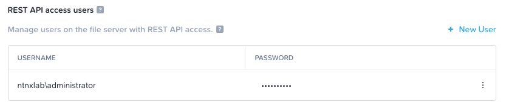

# Files: Share Migration

## Overview

A lot of customers have existing file shares on existing NAS setup and which need to be migrated to Nutanix Files. A lot of time they will leverage free migration tools like robocopy to migrate SMB shares. The common challenges of using common tools are the slow migration speed and complicated management. 

That is way we start to support share migration feature from Files 4.0.2. This feature help customer to migrate existing SMB shares to Nutanix Files flawlessly while taking advantage of Nutnaix Files internal architeceture to provide robust and optimize migration solution.

## Lab Preparation

In your **WinTools VM**, we have a share **my_secret** shared as **M:** drive. We will use this as an existing share to migrate to Nutanix Files.

1. Connect to your *Initials***-ToolsVM** via RDP or console using **NTNXLAB\\Administrator** user
2. Open **File Explorer** and go to **M:\** to check the existing share.
3. Right click the folder **confidential** > **Security** > **Edit**
4. Add **user01** to have **read access** to this folder.
   
5. Use putty or any ssh session tool to ssh to **FSVM** through the File Server **client network**.
   - Username : **nutanix**
   - Password : **nutanix/4u**

    !!!note

           The FSVM should have enabled ssh from client network. If you have difficulty ssh directly to the FSVM, you can choose to ssh to FSVM from CVM CLI.

## Share Migration

1. SSH to FSVM through client network IP address.
2. input command : afs
3. Run the following command to create migration source : 
     ```bash
     migration.source_add source_alias=[sourcename] source_fs_fqdn=[sourceshareIP] source_user=[domainuser]
     ```

    
    
    !!!note
            The domainuser must have **backup operator role** of the source share. Here in this lab we will use a domain administrator as the source user.
            
            The domain user should be in the format of **domainname\\\\user**. e.g. **NTNXLAB\\\\administrator**

4. Once the migration source is added, you can verify it by running : 
        ```bash
        afs migration.source_list
        ```
5. Then, create a migration plan by runnig this command :
        ```bash
        migration.plan_create name=[planname] source_alias=[source name used in step 3] source_share=[sourceshareIP] target_share=[xyz-GSO] migrate=false
        ```
    

    !!!note
            If you want to start the migration immediately after the creation of the plan, you can use **migrate=true** at the end of the command.

6. Start migration by running this command :
     ```bash
     migration.plan_migrate name=[planname used in step 5]
     ```

7. Check the status of the migration : 
     ```bash
     migration.plan_status name=[planname used in step 5] verbose=true
     ```

8. You may find the migration failed with the following reason, it is because the share contains user SID that cannot be found in the domain : 
        

9. To solve this problem, we need to run the migration plan again but allow unknown user SIDs presence in the share : 
     ```bash
     migration.plan_migrate name=[planname used in step 5] allow_unknown_sids=true
     ```

10. After a few minutes, check the status of the migration. 
        ```bash
        migration.plan_status name=[planname used in step 5] verbose=true
        ```
        You should see the status to be succeeded this time.
        

11. Go back to the file explore of **WinTools VM**, right click the folder **confidential** and go to **Properties > Security**, you can see **user01** has **read** access to this folder. That means the permission is successfully migrated to the target share.
        

12. Now let's try to rename and delete some files and do a delta sync of the migration. Go to **WinTools VM > M: drive** in **file explorer**. Now do the following :
    - Delete the file **HPE GL Webinar - 20210729.pdf**
    - Rename folder **confidential** to **"Open To Public"**

13. SSH to FSVM again, run the following command to start migration again and check the status afterwards.
     ```bash
        migration.plan_migrate name=[planname used in step 5] allow_unknown_sids=true

        migration.plan_status name=[planname used in step 5] verbose=true
     ```

14. You can see this time only 1 directory and 4 diles are transferred, it shows only changes are migrated instead of full copy.
        

15. Go back to **WinTools VM** to verify the updates on the target share **xyz-GSO**.

## Takeaway

Files Share Migraiton provides a native tool to migrate SMB shares to Nutanix Files. It does not require any additional cost, installation of software or any complex management. 

