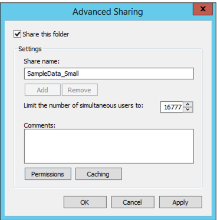
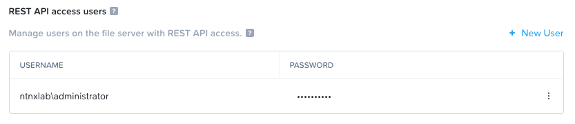
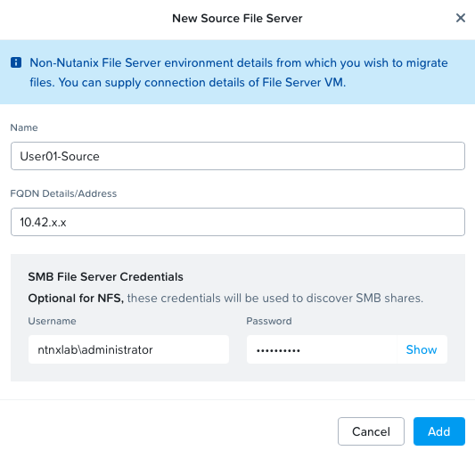
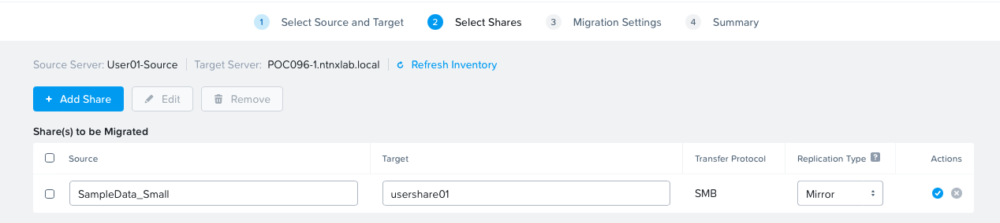

# Files: Share Migration

## Overview

Many customers have existing file shares on existing NAS infrastructure that need to be migrated to Nutanix Files. A lot of time they will leverage free migration tools like robocopy to migrate SMB shares. The common challenges of using common tools are the migration speed and complex management. 

Nutanix offers Nutanix Move tool which will enable migrating files to a new files server. Move also helps in moving virtual machines, but this lab will focus on Move's file migration capabilities.

Lets now explore the Move Files Migration Tool

## Lab Preparation

In your **WinTools VM**, there is a share **my_secret** mapped under **M:** drive. We will use this as an existing share to migrate to a remote Nutanix Files.

1. Connect to your *Initials***-WinToolsVM** (E.g User01-WinToolsVM) via RDP or console with the following credentials:
    
    - **Username** - ntnxlab\administrator	
    - **Password** - default (refer to lab lookup tool)
   
2. Download and extract the following [folder](http://10.42.194.11/workshop_staging/peer/SampleData_Small.zip) (right-click and download) using Chrome browser or ``curl`` tool

3. Right click on the extracted folder **Confidential** > **Sharing** > **Advanced Sharing**
   
4. Select the **Share this folder** check box
   
    
   
5. Click on **Apply**
6. Click on **OK**

## Setup Files Server API Permissions

1. In File Console, Configuration > Manage Roles 
   
2. Under REST API access users, click “+ New User”
   
    - **Username** - ntnxlab\administrator	
    - **Password** - default (refer to lab lookup tool) 
  
3. Click the check :material-check-circle: button to save it

    

## Setup Move for Files Migration

### Adding Target File Server 

A target file server has been provisioned for you. Refer to the lab lookup tool for target file server.

   
1. In your **WinTools VM**, open Chrome browser and type the IP address(find the IP address from the lab lookup tool) of the Move VM 
   
2. Logon using the following credentials
   
    - **Username**: nutanix
    - **Password**: default (refer to lab lookup tool)
  
3. Choose Files as the **Migration Type**
   
4. Click on **+New Migration Plan**
   
5. Use **MP-userYY** (E.g. MP-user01) as the name of your migration plan

!!!note
        Another user using the same target file server might have already configured it. 
        
        Select your target file server from the drop-down menu if it is already configured.

If this is the first time to login and without source and target file server, do the following: 

1. Click on **+ Add New Target** 
   
2. Enter the following details:

    - **Name** - UserXX-Target (e.g User01-Target)
    - **FQDN Details/Address** -  POCXXX-X.ntnxlab.local (e.g.POC096-3.ntnxlab.local)
    - **Username** - ntnxlab\administrator	(this is the REST API access user)
    - **Password** - default (refer to lab lookup tool)
  
3. Click **Add**
   
### Adding Source File Server

1. Click on **+ Add New Source** 
   
2. Enter the following details:

    - **Name** - UserXX-Source (e.g User01-Source)
    - **FQDN Details/Address** -  X.X.X.X (IP address of your UserXX-WinToolsVM e.g. 10.42.81.116)
    - **Username** - ntnxlab\administrator	(this is the REST API access user)
    - **Password** - default (refer to lab lookup tool)
     
    
  
3. Click **Add**

### Performing Migration

Move UI will now present the wizard to configure the migration plan.

1. Select the target and source (UserXX-WinToolsVM) file servers
   
2. Select **Mirror** as the Replication Type
   
3. Click on **+ Add Share** and fill the following details:
   
    - **Source** - SampleData_Small
    - **Target** - usershareXX (e.g. usershare01 depending on your username)
      
    

4. Click on the :material-check-circle: check mark 

5. Click on **Next**
   
    The wizard will now go through a validation phase.

6. Click **Next** on the Migration Settings page of the wizard
   
7. Confirm the migration details and click on **Save and Start**
   
8. Monitor the progress of the migration by click on the **Status** message until it is ready to cutover
   
9. Select the share > **Actions** > **Cutover**, the migration will be marked as completed
    
    !!!info
            Cutover simply means that we can no longer re-sync from source to target.

Using Move multiple shares (from different sources and targets) can be managed from a single GUI.

