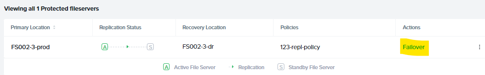
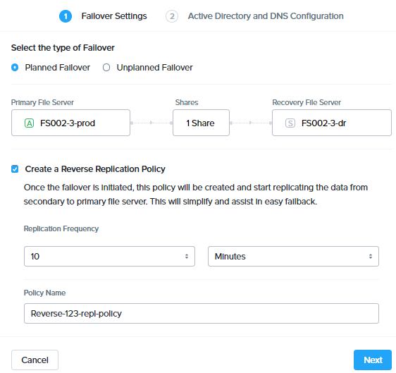
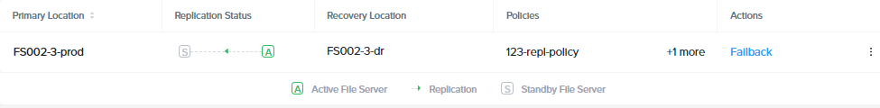
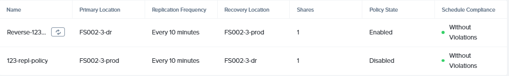

!!!info
        The estimated time to complete this lab is 60 minutes

## Overview

Smart disaster recovery (DR) is a data protection service for Nutanix
Files.

Smart DR facilitates share-level data replication and file-server-level
disaster recovery. In the event of a planned or unplanned loss of
service, you can restore write access to protected shares by
failing-over to a recovery site file server. Protection policies
indicate failover details, including the primary location, recovery
location, and the replication schedule. Rather than having a single
protection policy for an entire file server, you can configure unique
policies for different shares.

A short recovery time objective (RTO), helps ensure continuous
availability of data once you fail over to a recovery site. Configuring
Active Directory (AD) and domain name system (DNS) entries facilitates
seamless client access redirection.

The following figure gives an overview implementation of Replication in
Nutanix Files.

## Typical Data Protection Setup for Smart DR

The data protection process consists of the following procedures:

-   Configuring a Files Protection Policy to replicate share data to a recovery site
-   Configuring AD and DNS access for seamless client failover (if AD is different)
-   Configuring a reverse replication policy
-   Performing a planned or unplanned failover to DR site
-   Failing back to the primary site

## Lab Setup

We have already created File Server in the DR site and migrated files from existing share to xyz-GSO in the previous labs. We now will replicate the xyz-GSO share to the DR File Server.

    !!!note

            Make sure you have finished the labs of "Deploy Nutanix Files", "Create SMB Share" & "Share Migration" before this lab.

## Configure Files Protection Policy in Prism Central and Replicate

Smart DR feature for Files share replication is activated and maintained in Prism Central using Files Manager. In this section we will configure Smart DR requirements in Prism Central.

The Files Manager lets you view and control all of your file servers from a single control plane. Clicking a file server directs you to Nutanix Files in Prism Element (PE) where you can manage the shares, exports, and configurations of the file server. File server alerts for all registered file servers appear in a single pane for consolidated viewing, as do file server events.

The Files Manager provides the Smart DR service for Nutanix Files, which lets you protect file servers at the share-level.

1.  Logon to **Prism Central**

2.  Click on :fontawesome-solid-bars: > Services > Files

    !!!note

           If Files Manager is not enabled in your Prism Central, you will need
           to Enable Files using instruction in [Files Manager](../files_manager/files_manager.md)

        　　

3.  In Files Manager, click on **Data Protection > Polices > + New Policy**

4.  Select your **FS*xyz*-*a*-prod** (e.g. FS002-3-prod) as the **Primary Location (Source File Server)**

5.  Select **xyz-GSO** as **the Shares to be protected**

    !!!note

           Selecting the source Files server will automatically select all the shares within this files server to be protected
    
7.  Select your **FS*xyz*-*a*-dr** (e.g. FS002-3-dr) as the **Recovery Location (Target File Server)**

8.  Select the **Recovery Point Objective (RPO)** as **2** minutes and
    **Start Immediately**. (this is the lowest you can set as of now)

    !!!note 
           You can ignore the following warning as the this is just a test for Smart DR feature. In a customer environment the source and Target Files servers will be in different AOS clusters.
       
           **FS*xyz*-*a*-dr** is on the same AOS cluster as the source. It is recommended to have target file servers on a different AOS cluster.

9.  Make sure your selection looks as follows:

    

10. Click on **Next** at the bottom of the screen

11. Fill in the following details in **Settings** section:

    -   **Name** - *initials*-repl-policy (e.g.xyz-repl-policy)
    -   **Description** - Protection Policy for XYZ Prod to DR Replication (Optional)

12. Click on **Create**

13. Monitor the Tasks until the policy is created and the policy should show in the **Data Protection > Polices** in a few minutes

    

    Wait a few minutes until all the files are replicated and **RPO Compliant** will have a green-dot to indicate initial synchronization

14. Go to **Data Protection > Replication Jobs** and observe the
    replication jobs and duration. The initial replication will take time based on the amount of data and network speeds. But the subsequent replications will be based on incremental changes only.

    

15. Go to **Data Protection > Protected File Servers** to check the Active and Standby File servers. (Active indicated by a green A)

    

16. Verify it shows the DR Files Server with the source PROD share (e.g.``\\FSxyz-a-dr.ntnxlab.local\xyz-GSO``)

## Failover Share

We have set up replication of a share between two Files servers. Now we are able to test failover of the share to the DR File server.

There are two failover methods:

-   Planned Failover - allows a reverse-replication to the source File Server
-   Unplanned Failover - no reverse-replication (as an admin doesn't know when the primary site will be operational again)

Both these methods are manually triggered by an administrator.

In this lab we will test a Planned Failover

1.  Go to **Prism Central > Services > Files** (if you are note already on that page)

2.  Go to **Data Protection > Protected File Servers**

3.  Click on **Failover** as shown here

    

4.  Select **Planned Failover**

5.  Select **Create a Reverse-Replication Policy** and fill in the following

    - **Recovery Point Objective (RPO)** - 10 minutes
    -   **Policy Name** - **Reverse-xyz-repl-policy** (e.g. Reverse-xyz-repl-policy)

    

6.  Click **Next**

7.  In the **Active Directory and DNS Configuration** fill the following:
    (to ensure access to files after failover)

    -   **Username** - <administrator@ntnxlab.local>
    -   **Password** - nutanix/4u
    -   **Preferred Domain Controller** - ntnxlab.local or leave blank
    -   **Preferred Name Server** - 10.X.X.X or leave blank (Your AD IP address)

8.  Select the **Use the same credentials as the Active Directory**
    check-box (in our lab both the AD and DNS server are the same)

9.  Click on **Failover**

10. Monitor the Events in Prism Central

11. Once Failover is completed, return to **Files > Data Protection > Protected File Servers** in Prism Central and check the Active and Standby File servers. (Active indicated by a green A)

12. Confirm that **FSxyz-a-dr** (e.g. **FS002-3-dr**) server is now
    the active server

    

13. Return to your Windows Tools VM and access the failed over share in Windows Explorer

14. Login to your Windows Tools VM with the following credentials

    -   **Username** - <administrator@ntnxlab.local>
    -   **Password** - nutanix/4u

15. Browse to the location of your source share now hosted on PROD and DR Files server, you will find that both File Servers point to the same location.

    -   Prod path - ``\\FSxyz-a-prod.ntnxlab.local\xyz-GSO``
    -   DR path - ``\\FSxyz-a-dr.ntnxlab.local\xyz-GSO``

    

     This demonstrates that the users can access the share without having the change the file server names providing continuous access to the shares.

16. Logon to your AutoAD server and open DNS management (from Search
    button > type DNS )

    

    You can notice that both PROD and DR file servers point to the IP address of the DR File Server.

17. Go to **Data Protection > Replication Jobs** and verify that the source Files server is now **initials**-files-dr (e.g. xyz-files-dr) server

    

18. Go to **Data Protection > Policies** and verify a reverse replication policy is present, that means data is replicating from DR to production File Server now.

    

## Failback Share

Continue from the previous lab, we will see how to failback a share to the Source site after the environment is recovered.

In this lab we will test a Planned Failover

1.  Go to **Prism Central > Services > Files** (if you are not already on that page)

2.  Go to **Data Protection > Protected File Servers**

3.  Click on **Failback** as shown here

4.  In the **Active Directory and DNS Configuration** fill the following (to ensure access to files after failover)

    -   **Username** - <administrator@ntnxlab.local>
    -   **Password** - nutanix/4u
    -   **Preferred Domain Controller** - ntnxlab.local or leave blank
    -   **Preferred Name Server** - Your AD IP address or leave blank

5.  Select the **Use the same credentials as the Active Directory** check-box (in our lab both the AD and DNS server are the same)

6.  Click on **Next**

7.  Files now gives you a visual of the failed-back environment and informs you that the Reverse Replication policy will be deleted

    

8.  Click on **Failback**

9.  Monitor the Events in Prism Central

10. Once the failover is done, go to your Windows Tools VM and logon to the share hosted on PROD files server (e.g
    ``\\FSxyz-a-prod\xyz-GSO`` )

12. Logon to your AutoAD server once again and open DNS management (from Search button > type DNS )

    

    You can notice that the PROD file server has been reverted to the previous IP address.

14. We have successfully failed back the share to the PROD site. Now users can connect to the share as usual.

### Takeaway

Nutanix Files Smart DR makes it easy for administrators to configure replication of shares between Nutanix Files servers without needing third-party integrations.

For information about Files Manager and Smart DR features, refer to this documentation
[URL](https://portal.nutanix.com/page/documents/details?targetId=Files-Manager-v4_3:Files-Manager-v4_3).
