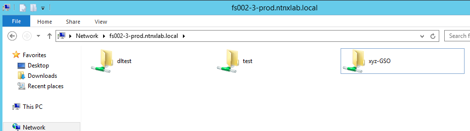
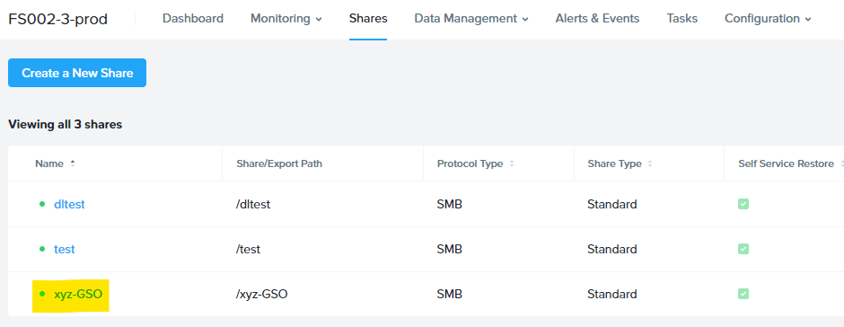
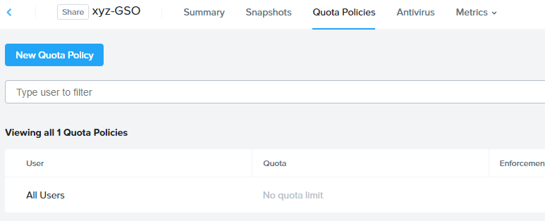

# Files: Create SMB Share

## Overview

In this exercise you will create and test a SMB share. SMB share are used to support home directories, user profiles, and other unstructured file data such as departmental shares commonly accessed by Windows clients.

## Lab Setup

1.  Connect to the Windows Tools VM via RDP or console
2.  Download the [sample files](<https://peerresources.blob.core.windows.net/sample-data/SampleData_Small.zip>) for File Analytics to the Tools VM

## Using SMB Shares

### Creating the Share

1.  In **Prism Element > File Server**, click on your **FS*XYZ*-#-prod** File Server

2.  Click on **Launch Files Console** 
    
    This will open in a new browser tab

    

3.  Select **Shares** and click on **Create a New Share**

4.  Fill out the following fields:

    -   **Name** - usershareXX (e.g. usershare01)
    -   **Description (Optional)** - Departmental share for GSO team
    -   **Share Path (Optional)** - Leave blank. This field allows you
        to specify an existing path in which to create the nested share.
    -   **Max Size (Optional)** - Leave blank. This field allows you to set a hard quota for the individual share.
    -   **Primary Protocol Access** - SMB

    

5.  Click **Next**.

6.  Select the following options:

    -   **Enable Self Service Restore**,
    -   **Enable Compression** and
    -   **Enable Access Based Enumeration**

    

    As you are creating a departmental share, it should be created as a
    **Standard** share. This means that all top level directories and
    files within the share, as well as connections to the share, are
    served from a single Files VM.

    **Distributed** shares are appropriate for home directories, user
    profiles, and application folders. This type of share shards top
    level directories across all Files VMs and load balances connections
    across all Files VMs within the Files cluster.

    **Access Based Enumeration (ABE)** ensures that only files and
    folders which a given user has read access are visible to that user.
    This is commonly enabled for Windows file shares.

    **Self Service Restore** allows users to leverage Windows Previous
    Version to easily restore individual files to previous revisions
    based on Nutanix snapshots.

7.  Click **Next**.

8.  Review the **Summary** and click **Create**.

    

9.  Use the same step to create a SMB share with name : **ransomwaretestXX** (e.g. ransomwaretest01) 

### Testing the Share

1.  Connect to your *Initials***-WinToolsVM** via RDP or console using
    **NTNXLAB\\Administrator** user

    !!!note

           The Tools VM has already been joined to the **NTNXLAB.local**
           domain. You could use any domain joined VM to complete the following
           steps.

2.  Open `\\FS*XYZ*-#-prod.ntnxlab.local\` in **File Explorer**.

    

3.  Test accessing the **usershareXX** (where XX is your username) share by creating a text file into the share.

    -   The **NTNXLAB\\Administrator** user was specified as a Files
        Administrator during deployment of the Files cluster, giving it
        read/write access to all shares by default.
    -   Managing access for other users is no different than any other
        SMB share.

4.  Right-click **usershareXX \> Properties**.

5.  Select the **Security** tab and click **Advanced**.

    

6.  Select **Users (FS*XYZ*-#-prod\\Users)** and click **Remove**.

7.  Click **Add**.

8.  Click **Select a principal** and specify **Everyone** in the
    **Object Name** field. Click **OK**.

    

9.  Fill out the following fields and click **OK**:

    -   **Type** - Allow
    -   **Applies to** - This folder only
    -   Select **Read & execute**
    -   Select **List folder contents**
    -   Select **Read**
    -   Select **Write**

    

10. Click **OK \> OK \> OK** to save the permission changes.

    All users will now be able to create folders and files within the xyz-GSO share.

    It is common for shares utilized by many people to leverage quotas to ensure fair use of resources. Files offers the ability to set either soft or hard quotas on a per share basis for either
    individual users within Active Directory, or specific Active
    Directory Security Groups.

### Adding Share Level Quota

1.  In **Prism Element \> File Server**, click on your FS*XYZ*-*A*-prod File Server

2.  Click on **Launch Files Console**

    

3.  Select **Shares** \> **usershareXX** (where XX is your username share)

    

4.  This will open the share details

5.  Click on **Quota Policies** \> **New Quota Policy**

    

6.  Fill out the following fields and click **Save**:

    -   Select **User Group**
    -   **User or Group** - SSP Developers
    -   **Quota** - 10 GiB
    -   **Enforcement Type** - Hard Limit

    

7.  Click **Add**.

8.  This will enforce quota limits on the shares for AD user group **SSP
    Developers** to stay within limit

9.  With the **usershareXX** (where XX is your username) \> **Summary** selected, review the
    **Capacity Summary**, **Performance Summary** and **Share
    Properties** tabs to understand the available on a per share basis,
    including the number of files & connections, storage utilization
    over time, latency, throughput, and IOPS.

    

10. **Remove all the user group policy before goint to the next lab.**
