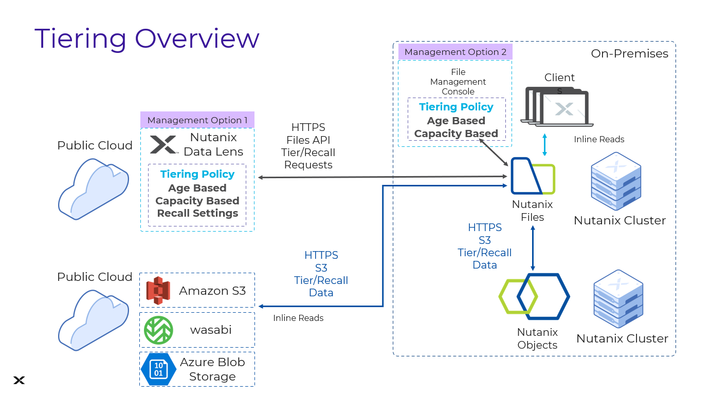
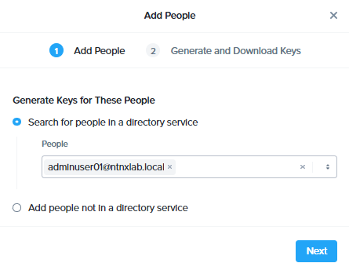
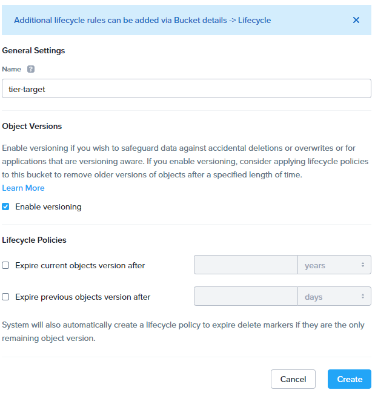

# Files Smart Tiering 

## Overview

Data storage can get quite expensive for applications using file service storage especially for data that does not access for months or years.

To enable applications to have data that is infrequently used to be tiered to object storage which may be cheaper and in a different region, Nutanix Files provides tiering feature to tier to either Nutanix Objects or varies cloud base object storage.

This will enable customers to do the following:

-   Tier to third-party objects based cloud storage
-   Reduce storage consumption and cost for storing data that are old and infrequently used
-   Decouple the application from managing storage and have Nutanix's proven HCI Storage features to effectively manage data
-   Use industry standards for Objects like storage

## Possible Tiering Configurations

Nutanix Objects is capable of tiering to any S3 compatible objects store provider.



To accomplish this tiering we need the following:

-   **Destination S3 Storage**
    -   Destination S3 access URL
    -   Destination Access key
    -   Destination Secret key
-   **Networking between source and destination**
    -   Physical connectivity
    -   Firewall and security allowing for this connection

## Lab Setup

**In this lab, you will walk through a Nutanix Files Smart Tiering feature to Nutanix Objects only. The configuration procedure remains the same for other supported S3 service on public cloud**.

We will use the File Server and Object Store in the lab for this lab.
### Setup Endpoint in Object Store Configuration

In this section you will setup endpoints for tiering from Nutanix
Objects that has been pre-deployed for you to AWS S3.

## Get Configuration Details on Nutanix Objects

1.  Logon to **Prism Central**

2.  Click on :fontawesome-solid-bars: > **Services** > **Objects**

3.  Record the **Objects Public IP** for **ntnx-objects**

4.  Click **Access Keys** > **+ Add People**

5.  Click **+ Add Directory** to add directory service for users, then fill the following :
    -   **Name** - ntnxlab
    -   **Domain** - ntnxlab.local
    -   **Directory URL** - ldap://[Your AD IP Address]:389
    -   **Username** - ntnxlab\Administrator
    -   **Password** - nutanix/4u
    
6.  Click **Add**
    

7.  Search for **adminuser01** as the user and click the checkbox next to it.
    

8.  Click **Next** > **Generate Key** > **Download Key**

9.  Once you download the key and open the key file, you will see information like this. Keep the secret key and access key for later session :
    
    ```bash title="Sample file only - do not copy"
    Username: adminuser01@ntnxlab.local

    Access Key: PE_5lYhc5exAc-_gDzO2_xO8FGDdJg4_

    Secret Key: fIRBeAzHNOE7sl3Wei88h_LFiL0KozKb

    Display Name: Adminuser01
    ```

10. Go back to **Prism Central**, click on :fontawesome-solid-bars: > **Services** > **Objects**

11. Click the **Objects Public IP** to access the Object Browser, use the Access Key and Secret Key to login

12. then click **Create Bucket**, use **tier-target** as the name and click the checkbox of **Enable versioning**, then click **Create**.
        

## Enable and Configure Files Smart Tiering

1.  Logon to **Prism Element**

2.  Go to **File Server**, and click **Launch Files Console** next to **FS*xyz-a*-prod**.

3.  In **Files Console**, go to **Data Management** > **Tiering**, you can see that Files Smart Tiering is not enabled yet. 

4.  Click 1.  Logon to **Prism Central**
    

    !!!note 
           In real deployment, you can also choose to enable Smart Tiering in Data Lens.

5.  Click **Add Tiering Location**

6.  Fill in the following : 
    - **Name** - ntnx-objects
    - **Storage Type** - Nutanix Object Store
    - **Service Host** - [ntnx-objects Objects Public IP]
    - **Access Key** - Access Key of adminuser01
    - **Secret Key** - Secret Key of adminuser01
    - **Proxy Server** - leave blank
    - **Bucket Name** - tier-target
    - **Retention Period** - 6 Month
    - Check **Skip SSL Certificate Validation**

7.  Click **Add**  
    
    

8.  Once tiering location is configured, we can strat to set policy. Click **Set a Capacity Threshold**, you can set a capacity threshold so that tiering policy will only be run when the capacity usage is exceeded the percentage. For this lab, we do not set threshold so do not click **Set Capacity Threshold** and keep **Manual** selected under **When to Tier**. Then click **Save**.

9.  Now click **Create a Tiering Policy**

10. Here you can define the tiering policy by setting the **Access Time** and **File Size**. You can set these two to any acceptable values.

    !!!note 
           File Size need to set at least 64KB.

11. Click **Excludes Shares** and exclude all shares except **xyz-GSO**.
    


## Verify Smart Tiering behavior

To speed up, we will verify the behavior by doing manual tiering in AFS CLI.

1.  SSH to FSVM via FSVM's client network or CVM

2.  Enter in CLI and then tier the following file: 
   
    ```bash
    <afs> tiering.tier xyz-GSO file_paths="MLPA 8475.png"
    ```
    

3.  You can check the tiering status by ``tiering.status xyz-GSO file_paths="MLPA 8475.png``, you can see this file has a status Offline, showing that it is already tiered.
    
    !!!note 
           If you try to tier a file less than 64KB, you will find it was not tiered successfully.

    

4.  You can login to your **WintoolsVM** and check the share folder of **xyz-GSO**. You will see the tiered file with a **CROSS** on the file icon. That means this file only has a stub in the file share. The actual content is in object store target.

    

5.  Now right click the tiered file > **Open With** > **Paint**. You can do read access to a tiered file. 

You have successfully tiered from Nutanix Files to Objects using Smart Tiering.

## Takeaways

What are the key things you should know about **Nutanix Files Smart Tiering**?

-   Nutanix Files allows easy configuration for tiering data to object stores (cloud and on-premises)
-   Tiering feature is managed either from Files Console (On-prem) or Nutanix Data Lens (on cloud)
-   After a file is tiered to object store, you can still do inline read. The file needs to be recalled to file share in order to overwrite.
-   Nutanix enables applications to store and tier data to any S3-based object storage without lock-in
