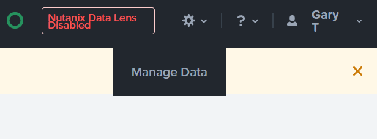
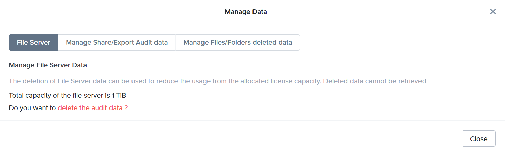
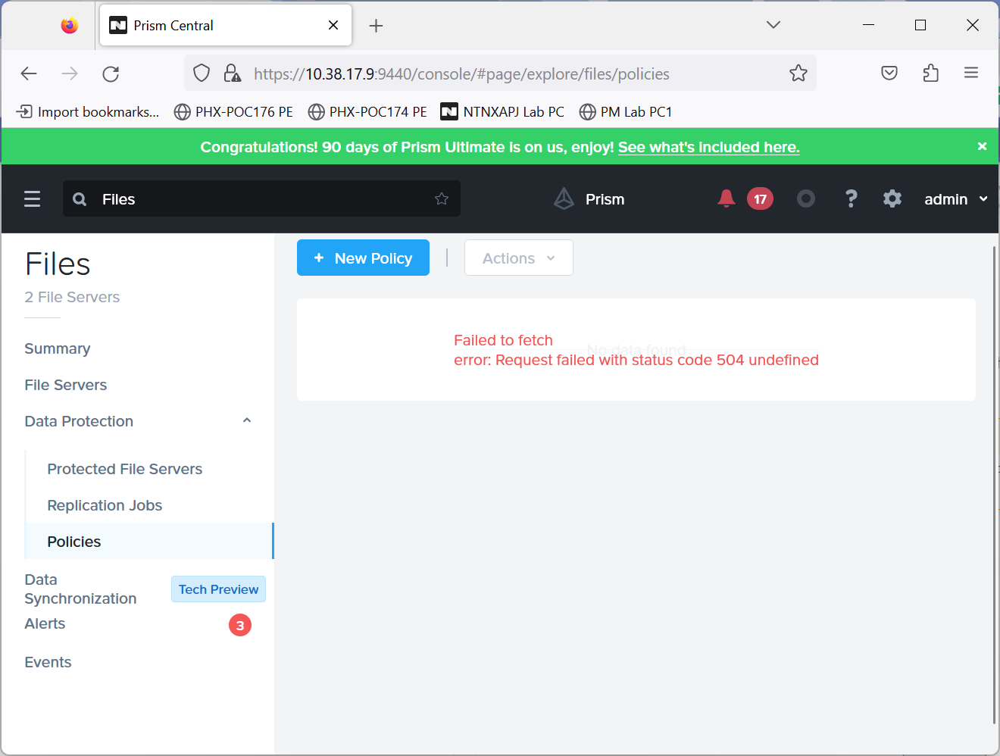

## General
1. Login to PC > Administration > LCM > Inventory > Perform Inventory
2. Upgrade PC (if not on 2022.6.x), Files Manager, Objects (if not on 3.6) from PC
3. Repeat previous step to upgrade Files Manager to 4.3
4. Login to PE > LCM > Inventory > Perform Inventory
5. Upgrade Files from 4.2.1.1 to 4.3
6. Enable PC MSP : 
      1. PC LCM > Settings > uncheck Enable HTTPS > Save
      2. PC Gear Icon > Prism Central Management > PC on Microservices Infrastructure > Enable Now > Continue > Validate > Enable
7. Delete unuse VMs : SSH to CVM > acli > vm.delete Peer* > yes

## Change FS name & Remove FA:
1. leave domain
2. change name to FS[xyz]-[#]-prod
3. enable SMB protocol in FIle Console
4. Delete File Analytics : PE > File Server > Manage File Analytics > Delete

## Fix File Console bug
1. login to CVM
2. vi /home/nutanix/minerva/bin/minerva_cvm_test_patch.py
     - put this in the .py:
        ```bash
            import env
            import gflags
            import thread
            import util.base.log as log
                        
            from minerva.cvm.server import MinervaCvmServer

            FLAGS = gflags.FLAGS

            original_MinervaCvmServer__initialize = MinervaCvmServer._MinervaCvmServer__initialize

            def monkey_MinervaCvmServer__initialize(self):
            original_MinervaCvmServer__initialize(self)
            log.INFO("Starting minerva_cvm_gateway frm monkey_patch: %s" % FLAGS.minerva_is_light_compute_node)
            if FLAGS.minerva_is_light_compute_node:
                thread.start_new_thread(self.start_minerva_cvm_gateway, ())
            log.INFO("GATEWAY MONKEY PATCH WORKING")

            MinervaCvmServer._MinervaCvmServer__initialize = monkey_MinervaCvmServer__initialize
        ```
3. Set permission : 
        ```bash
            chmod 750 /home/nutanix/minerva/bin/minerva_cvm_test_patch.py
        ```
4. SCP to all other CVMs and restart minerva_cvm : 
        ```bash
            for i in `svmips`; do echo "CVM IP: $i"; scp /home/nutanix/minerva/bin/minerva_cvm_test_patch.py $i:/home/nutanix/minerva/bin/minerva_cvm_test_patch.py; ssh $i /usr/local/nutanix/cluster/bin/genesis stop minerva_cvm; done
        ```
5. restart cluster : 
        ```bash
            cluster start
        ```
6. verify the result : 
        ```bash
            allssh 'grep "GATEWAY MONKEY PATCH WORKING" /home/nutanix/data/logs/minerva_cvm.log; ps -eaf | grep minerva_cvm_gateway | grep -v grep | tail -n 1'
        ```

## Enable Data Lens
1. VM > FSVM > Launch Console > login : nutanix | nutanix/4u
2. enable FSVM ssh : 
        ```bash
            afs misc.ssh_on_client_network enable
        ```
3. find CVM Cluster UUID from PE
4. find FSVM UUID in FSVM CLI: 
        ```bash
            zeus_config_printer | grep cluster_uuid
        ```
5. go to website : [register UUID](https://awsinfra.nusightsinfra.com/help)

    - put "faqa" in Data Pipeline
    - add both UUID in this site to register 

6. Modify cfs.config
        ```bash
            allssh "vi /home/nutanix/minerva/nusights/config/cfs/cfs.config"
        ```
      - Add the following code to the file
        ```bash
            modify endpoint_info_list as follow
                endpoint_info_list {
                endpoint: "faqa.nusightsinfra.com:443"
                uuid: "<CLUSTER_UUID>"
                is_governing: true
            }
        ```

7. Modify minerva_nvm.gflags
        ```bash
            allssh "vi /home/nutanix/config/minerva_nvm.gflags"
        ```
      - Add the following code to the file
        ```bash
            --minerva_cfs_dump_transported_data_to_file=true
            --minerva_cfs_debug_level=3
            --minerva_cfs_control_center_poll_freq_secs=120
        ```

8. Stop FS
        ```bash
            allssh genesis stop minerva_nvm
        ```

9. Run this
        ```bash
            zkrm /appliance/physical/cfs_configuration
            allssh USE_SAFE_RM=no rm -rf /home/nutanix/data/nusights/*
            cluster start
        ```

10. Check if fa_cloud_collector is running
        ```bash
            ps -aef | grep fa_cloud_collector
        ```

11. Verify pulse
        ```bash
            allssh "curl http://127.0.0.1:2042/h/connectivity_status | python -m json.tool"
        ```

12. Wait for 10 mins, login to [https://datalens-qa.nutanix.com/home](https://datalens-qa.nutanix.com/home) to check if the FS is there.

13. Enable Data Lens for FS

14. Go to Ransomware Protection, enable

## Prepare WinToolsVM
1. Create a SMB share in prod FS : DLtest-prod
2. Copy [sample_files_for_migration.zip](files/sample_files_for_migration.zip) and unzip the files in DLtest-prod
3. Create a folder "my_secret" in C:\
4. Copy [sample_files_for_migration.zip](files/sample_files_for_migration.zip) and unzip the files in my_secret
5. Share my_secret as a share folder.
6. Map my_secret as M:\ drive in the wintoolsVM

# Troubleshooting

## Data Lens is not updating with new Files operations

To resolve the problem, you need to re-enable Data Lens for the FS:

1. ssh to FSVM, restart minerva

    ```bash
        genesis stop minerva_nvm
        cluster start
    ```

2. Go to Data Lens, search for your FS, click **disable** > **Disable Nutanix Data Lens**

3. After finishing disable, find the FS in Data Lens, click the FS name to go to the dashboard page of the FS.

4. Click the gear icon on the top right corner > **Manage Data**
        

5. Go to **File Server** tag > **delete the audit data** > **Confirm**
        

6. After deletion completed, seach for your FS again, and click **Enable**


## Have "Failed to fetch" Error when trying to set Smart DR policy in File Manager

What you will see:
  

1. Resolve by doing this:

    ```bash
        docker exec -it files_manager /bin/bash
        vi /etc/hosts 
    ```

2. Add this line in the hosts file.

    ```bash
        [PCIP] iam-proxy.ntnx-base
    ```

3. Check again if the fetching problem esists.