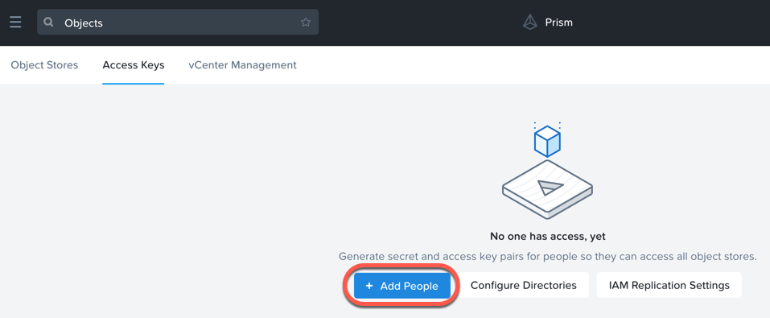
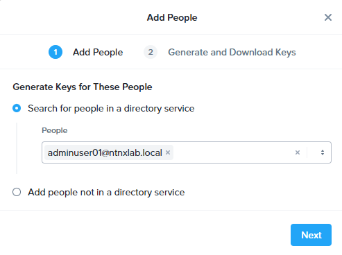
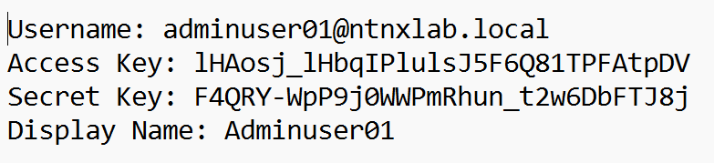
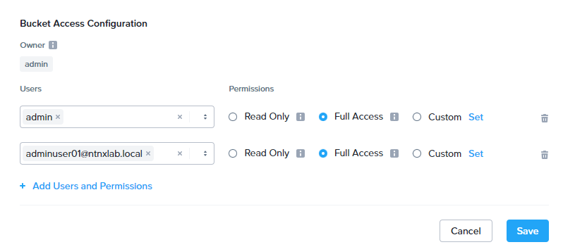

# Objects: Creating Buckets, Users, and Access Control

!!!info

       The estimated time to complete this lab is 60 minutes

## Overview

## Create Bucket In Prism

A bucket is a sub-repository within an object store which can have
policies applied to it, such as versioning, WORM, etc. By default a
newly created bucket is a private resource to the creator. The creator
of the bucket by default has read/write permissions, and can grant
permissions to other users.

1.  Go to Prism Central

2.  Go to :fontawesome-solid-bars: > Services  > Objects

3.  Click on **ntnx-objects** Objects Store

4.  The Objects Store management will open in a new browser tab

5.  Click **Create Bucket**, and fill out the following fields:

    -   **Name** - **your-name**-my-bucket
    -   **Enable Versioning** - Checked
    -   **Multiprotocol Access** - disabled (selecting **Enable
        versioning** will disable this)

    

6.  Click **Create**.

    !!!note

           Buckets created via Prism Central are owned by the Prism Central
           admin.

    If versioning is enabled, new versions can be uploaded of the same
    object for required changes, without losing the original data.

    Lifecycle policies define how long to keep data in the system.

    Once the bucket is created, it can be configured with WORM.

    WORM (Write Once, Read Many) storage prevents the editing,
    overwriting, renaming, or deleting data and is crucial in heavily
    regulated industries (finance, healthcare, public agencies, etc.)
    where sensitive data is collected and stored. Examples include
    e-mails, account information, voice mails, and more.

    !!!note

           If WORM is enabled on the bucket, this will supersede any lifecycle policy.

7.  Check the box next to your *your-name*-**my-bucket** bucket, and click on **Actions** dropdown and choose **Configure WORM**

8.  Check the box next to **Enable WORM** bucket,

9.  Enter **1** month as the retention periodand click **Enable WORM**.

    !!!note

           You have the ability to define a WORM data retention period on a per bucket basis.

## Buckets User Management

In this exercise you will create generate access and secret keys to access the object store, that will be used throughout the lab.

1.  Go to Prism Central

2.  Go to :fontawesome-solid-bars: > Services  > Objects

3.  From the Objects UI, click on **Access Keys** and click **Add People**.

    

4.  Select **Add people not in a directory service** and enter your e-mail address.

    

5.  Click **Next**.

6.  Click **Generate Keys** to generate a ket.

    

7.  Click **Download Keys** to download a .txt file containing the
    **Access Key** and **Secret Key**.

    

8.  Click **Close**.

9.  Open the file with a text editor.

    

10. Repeat the process above for a second user, so that you have two
    pairs of keys.

    !!!note 

           Keep the text files open so that you have the access and secret keys
           readily available for future labs.
## Adding Users to Buckets Share

1.  Go to Prism Central

2.  Go to :fontawesome-solid-bars: > Services > Objects

3.  Click on **ntnx-objects** Objects Store

4.  The Objects Store management will open in a new browser tab (if it
    not already open)

5.  Click on **your-name**-**my-bucket** bucket, and click on **User
    Access**

6.  Click on **Edit User Access** button

    This is where you will be able to share your bucket with other
    users. You can configure read access (download), write access
    (upload), or both, on a per user basis.

7.  Add the user (email address)you created earlier, with *Read* and
    *Write* permissions

    

8.  Click on **Save**

## Takeaways

What are the key things you should know about **Nutanix Objects**?

-   Nutanix Objects provides a simple and scalable S3-compatible object
    storage solution, optimized for DevOps, Long Term Retention and
    Backup Target use cases.
-   Nutanix Objects can be deployed on an AHV cluster, with ESXi support
    on the roadmap.
-   Nutanix Objects will be enabled and deployed from Prism Central.
