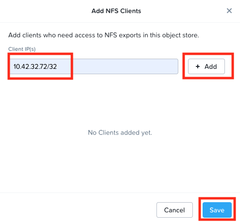
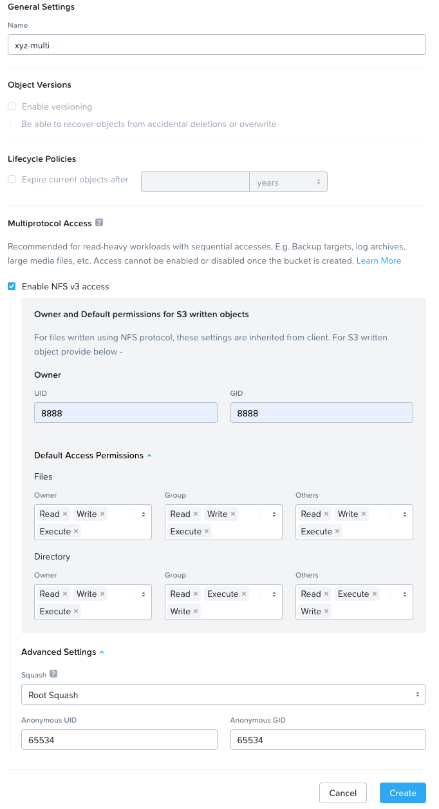
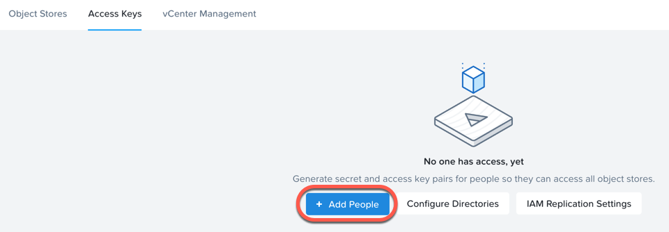
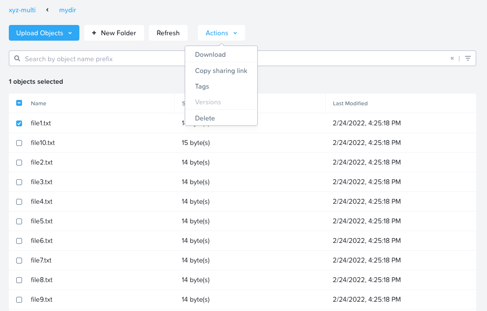

# Objects: Multiprotocol

In this section, we will see how to create a bucket and let a NFS client
access this to be able to do regular folder and files operations.

-   Objects multiprotocol is a new feature with Objects 3.3.1
-   Multiprotocol feature only works with a fresh install of Object
    3.3.1 onwards
    -   Upgrading existing Objects 3.2.1 to 3.3.1 or above doesn't
        allow for this functionality (this is due to a MSP integration
        issue. Might be resolved in future)
-   Multiprotocol enabled bucket doesn't support versioning of objects
    that it hosts
-   This lab uses a fresh install of Objects 3.4.0.2 - Objects
    multiprotocol feature is available as is

## Lab Agenda

We will do the following in this lab:

-   Configure NFS access to a specific NFS client (your
    **Initials-Linux-ToolsVM**) for the objects store
-   Create bucket and specify NFS multiprotocol access
-   Mount the bucket as a NFS share in the NFS client (your
    **Initials*-Linux-ToolsVM**)
-   Perform file and folder level operation in the NFS client
-   Perform file and folder level operation in the objects browser

## Configure NFS Allow Client

In this section we will allow your *LinuxToolsVM* to be able to access
buckets using NFS3 protocol.

1.  Go to Prism Central

2.  Go to :fontawesome-solid-bars: > Services > Objects

3.  Click on **ntnx-objects** Objects Store

4.  The Objects Store management will open in a new browser tab

5.  Click on **NFS Clients Allowlist**

6.  Click on **Add Client**

    

7.  Enter your *Initials*-**Linux-ToolsVM** IP address followed by `/32`
    to specify access only to this client

    

    !!!note

           You are also able to allow a range of clients by denoting the a CIDR
           block
       
           E.g. 10.42.32.192/`26` 10.42.4.128/`25`

8.  Click on **+ Add** and **Save** at the bottom of the pop-up window

## Create Bucket In Prism

A bucket is a sub-repository within an object store which can have
policies applied to it, such as versioning, WORM, etc. By default a
newly created bucket is a private resource to the creator. The creator
of the bucket by default has read/write permissions, and can grant
permissions to other users.

1.  Go to Prism Central

2.  Go to :fontawesome-solid-bars: > Services > Objects

3.  Click on **ntnx-objects** Objects Store

4.  The Objects Store management will open in a new browser tab

5.  Click **Create Bucket**, and fill out the following fields:

    -   **Name** - *Intials*-multi
    -   **Enable NFS v3 access** - checked
    -   **Owner UID** - 8888
    -   **Owner GID** - 8888

6.  For **Default Access Permissions** select in the following:

    !!!warning

              We are configuring all permissions and priveleges here. However in a
              production environment you would be careful about giving the
              appropriate permissions.

    -   **Files**
        -   **Owner** - read, write, execute
        -   **Group** - read, write, execute
        -   **Others** - read, write, execute
    -   **Directory**
        -   **Owner** - read, write, execute
        -   **Group** - read, write, execute
        -   **Others** - read, write, execute
    -   **Advanced Settings** - default (leave as-is)

    

7.  Click **Create**

## Buckets User Management

!!!warning

          Perform these steps only if you **have not** created a user before and
          **have not** downloaded the access keys in the previous [Buckets & UAC](../objects_buckets_users_access_control/objects_buckets_users_access_control.md) section.

In this exercise you will create generate access and secret keys to access the object store, that will be used throughout the lab.

1.  Go to Prism Central

2.  Go to :fontawesome-solid-bars: > Services > Objects

3.  From the Objects UI, click on **Access Keys** and click **Add People**.

    

4.  Select **Add people not in a directory service** and enter your
    e-mail address.

    

5.  Click **Next**.

6.  Click **Generate Keys** to generate a ket.

    

7.  Click **Download Keys** to download a ``.txt`` file containing the
    **Access Key** and **Secret Key**.

    

8.  Click **Close**.

9.  Open the file with a text editor.

    

## Adding Users to Buckets Share

In this section, we will add user to the **Intials-multi** bucket, so we
can access the bucket to upload/create files and folders.

1.  Go to Prism Central

2.  Go to :fontawesome-solid-bars: > Services > Objects

3.  Click on **ntnx-objects** Objects Store

4.  The Objects Store management will open in a new browser tab (if it
    not already open)

5.  Click on **Intials-multi** bucket, and click on **Share**

    

6.  Click on **Edit User Access** button

    This is where you will be able to share your bucket with other
    users. You can configure read access (download), write access
    (upload), or both, on a per user basis.

7.  Add the user (email address)you created earlier, with *Read* and
    *Write* permissions

    

8.  Click on **Save**

## Accessing Bucket on NFS Client

In this section we will mount the **Intials-multi** bucket as a NFSv3
share on the **initials-Linux-ToolsVM** to create files and folders.

1.  Login to the *Initials*-**Linux-ToolsVM**, with the following
    credentials

    -   **Username** - root
    -   **Password** - default nutanix password

2.  **Optional step** - make sure nfs-utils package is installed if not
    already done so.

    ``` bash
    yum install -y nfs-utils
    ```

3.  Change user to centos

    ```bash
    sudo su - centos
    ```

4.  Edit the `/etc/fstab` file to include the following nfs mount

    ```bash
    sudo vi /etc/fstab
    sudo mkdir -p /mnt/buckets

    # Add this line to the end of the file

    <object-store-IP>:/xyz-multi /mnt/buckets   nfs rw,noauto,user 0 0
    # example below
    # 10.42.32.136:/xyz-multi /mnt/buckets  nfs rw,noauto,user 0 0
    ```

5.  Mount the bucket as a NFS share

    ```bash
    mount /mnt/buckets
    ```

6.  Create a directory and some files under the new directory

    ``` bash
    cd /mnt/buckets
    mkdir mydir1
    cd mydir1
    ```
    ``` bash
    for i in {1..10}; do echo "writing file$i .."; touch file$i.txt; echo "this is file$i" > file$i.txt; done
    ```
    ``` bash
    # list your files
    ls -l
    ```
    ``` {.bash .no-copy}
    [mydir1]$ ll
    # output here
    -rw-rw-r-- 1 centos centos   15 Feb 23 23:25 file10.txt
    -rw-rw-r-- 1 centos centos   14 Feb 23 23:25 file1.txt
    -rw-rw-r-- 1 centos centos   14 Feb 23 23:25 file2.txt
    -rw-rw-r-- 1 centos centos   14 Feb 23 23:25 file3.txt
    -rw-rw-r-- 1 centos centos   14 Feb 23 23:25 file4.txt
    -rw-rw-r-- 1 centos centos   14 Feb 23 23:25 file5.txt
    -rw-rw-r-- 1 centos centos   14 Feb 23 23:25 file6.txt
    -rw-rw-r-- 1 centos centos   14 Feb 23 23:25 file7.txt
    -rw-rw-r-- 1 centos centos   14 Feb 23 23:25 file8.txt
    -rw-rw-r-- 1 centos centos   14 Feb 23 23:25 file9.txt
    ```

7.  Now go to the Objects browser GUI by going back to Prism Central

8.  Go to :fontawesome-solid-bars: > Services > Objects

9.  Click on **ntnx-objects** Objects Store

10. The Objects Store management will open in a new browser tab

11. Click on *Intials*-multi bucket and **Launch Objects Browser**

    This will open in a new browser tab

    

12. Provide the access key and secret key you downloaded before in the
    `buckets_sharing`{.interpreted-text role="ref"} section

    

13. Click on **Login**

14. Check if your files are present in the *Intials*-multi bucket

    

    !!!info
       
           Although you see directories, these are mere objects. It is a cosmetic
           representation of a folder like structure in Objects Browser. However, if you analyse the buckets, these objects would be stored differently.

15. Download one of the files, by selecting the file and selecting
    Download from the drop down menu.

    

16. Verify the contents of the file

    

17. Create a new sub-directory through Object Browser by clicking on **+
    New Folder** and entering the name **mysubdir1**

18. Click on **Create**

    

19. Return to your **Initials-Linux-ToolsVM** and list the share to
    see if newly created ``subdir1`` is present

    ```{ .text .no-copy }
    [mydir]$ ll

    # output here
    #
    -rw-rw-r-- 1 centos centos   15 Feb 23 23:25 file10.txt
    -rw-rw-r-- 1 centos centos   14 Feb 23 23:25 file1.txt
    -rw-rw-r-- 1 centos centos   14 Feb 23 23:25 file2.txt
    -rw-rw-r-- 1 centos centos   14 Feb 23 23:25 file3.txt
    -rw-rw-r-- 1 centos centos   14 Feb 23 23:25 file4.txt
    -rw-rw-r-- 1 centos centos   14 Feb 23 23:25 file5.txt
    -rw-rw-r-- 1 centos centos   14 Feb 23 23:25 file6.txt
    -rw-rw-r-- 1 centos centos   14 Feb 23 23:25 file7.txt
    -rw-rw-r-- 1 centos centos   14 Feb 23 23:25 file8.txt
    -rw-rw-r-- 1 centos centos   14 Feb 23 23:25 file9.txt
    drwxrwxrwx 2   8888   8888 4096 Feb 23 23:01 mysubdir1  # << this is the sub directory you created in Objects Browser

    # Note the the UID and GID for the directory created from Objects Browser side
    ```

20. Add a few more folders and files from the Objects browser side and
    check if it shows on the NFS client side.

You have successfully completed this lab and tested multiprotocol
access to a bucket.

## Takeaways

-   Objects 3.3.x onwards allows multiprotocol access for objects
-   This is recommended for read-heavy workloads with sequential
    accesses, E.g. Backup targets, log archives, large media files, etc.
    Access cannot be enabled or disabled once the bucket is created.
-   Administrators can easily switch between access patterns (s3 or NFSv3) to suit their requirements with managing objects
