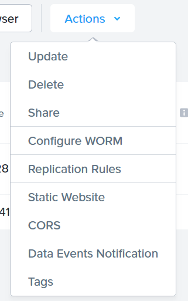
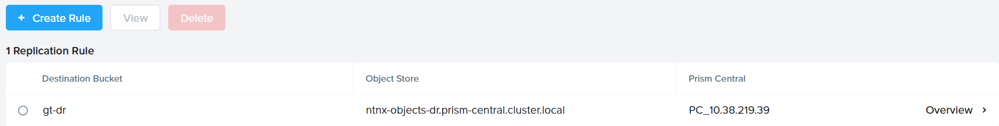

!!!info
        The estimated time to complete this lab is 20 minutes

## Overview

Streaming Replication is a data protection service for Nutanix Objects.

With objects streaming replication, you can replicate objects between different Nutanix object stores using streaming replication, a native data protection capability of Nutanix Objects. Streaming replication copies every object (and object part) that is written to a protected bucket to a corresponding remote bucket (or buckets) as soon as the PUT request finishes. Streaming replication copies object metadata and WORM lock timers along with the data. Streaming replication generally provides a low recovery-point objective (RPO), although factors such as write rate, object size, and intersite bandwidth all influence the RPO.

Nutanix Objects supports up to five source buckets replicating to a single destination bucket (fan-in replication) and one source bucket replicating to up to three destination buckets (fan-out replication).

With Nutanix Objects versions 3.5 and later, you can skip replicating delete markers to the destination bucket so that deletions on the source bucket aren't mirrored on the destination bucket. The life-cycle policies on the source and destination buckets are also entirely separate so that the destination bucket can have a much longer retention period than the source bucket.

The source and destination buckets are read and write, meaning that a Nutanix Objects disaster recovery setup is inherently active-active. This setup helps speed up the failover and failback processes between object stores.

## Lab Setup

We will use the two Object Stores that has been created for this lab setup.

!!!note
        Make sure you have finished the labs of "Deploy Nutanix Objects", "Create Buckets" before this lab.

## Create replication rule

1.  Go to Prism Central, click **Infrastructure > Objects**

2.  In Object Stores, click **ntnx-objects** to enter another UI to manage **ntnx-objects**.

3.  Go to Buckets, select the bucket you created previously - **your-name**-**my-bucket**, then **Actions > Replications Rules**.

    

4.  From the bucket management UI, click **+ Create Rule**.

5.  In Namespace, choose **ntnx-objects-dr** and put **your-name**-**my-bucket-dr** as the bucket name, then click **Save**.

6.  After it is saved, you can see the replication rule created.

     

## Verify replication behavior

1.  Go to Prism Central, click **Infrastructure > Objects**

2.  Select **ntnx-objects** and then click **Actions > Launch Objects Browser**

3.  Login using the key pairs generated before.

4.  Login to ntnx-objects-dr Objects Browser following the same steps.

5.  Go to both buckets you created from the two object stores, try to upload different files from two buckets and see if the objects get replicated to another object store.
 
### Takeaway

Nutanix Objects Streaming Replication enables a simplified management of object replication of buckets between multiple object stores, allows bi-directional active-active replication without the need of third-party tools.
