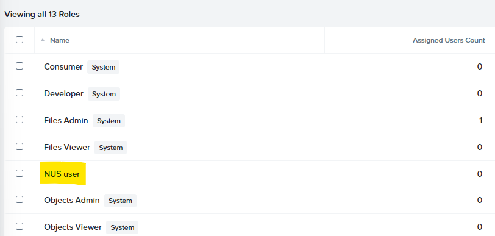
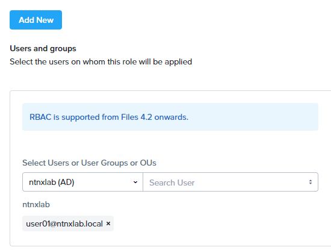
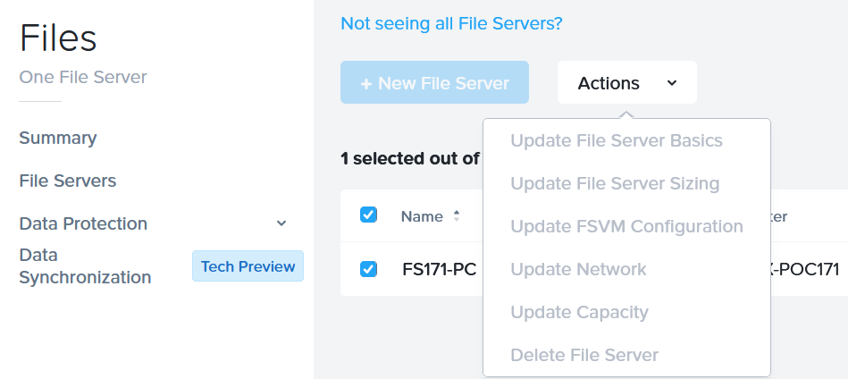

# Role Base Access Control for NUS

## Overview

Cluster role-based access control (RBAC) feature enables a super-admin user to define different access right to Nutanix Files and Objects in Prism Central. Admin can choose default or customized role to assign to users to provide admin or view access to a particular Files or Objects entity. The access right can be assigned to File Server or Object Store level so different user can manage different FS or OSS according to the management requirement.

## Lab Setup

The lab has enabled MSP on Prism Central which is a pre-requisite of using RBAC. In real deployment, you should first enable microservices infrastruture before starting this lab.

## Define Roles

1. Login to Prism Central as **admin**, select :fontawesome-solid-bars: **> Administration > Roles**, click **Create Role**

    

2. In this menu, fill out the fields:

    -   Put **Role Name**: **NUS View Only User**
    -   Expand **Object Store**, click **View Access**
    -   Expand **File Server**, click **View Access**
        
    -   Click **Change** next to **Set custom permissions** in **File Server**
    -   Click **Create File Server Share**, then click **Save**
        
    -   Click **Save**

3. You will find **NUS user** is showing in the Role.
    

## Assign Users to Roles

1. In Prism Central as **admin**, select :fontawesome-solid-bars: **> Administration > Roles**, click **the checkbox next to NUS user**

2. Click **Action** > **Manage Assignment** > **Add New**

3. In the **Search User** box, put **userXX** and select **userXX@ntnxlab.local** (where XX is the assigned user number to you)
    

4. In the right side, choose **File Server** as the Entity Type, then select **Individual entity**

5. In the search box, find and select **FS*XYZ*-PC**

6. Choose **Object Store** as the Entity Type, in the search box. find and select **ntnx-objects**
    

7. Click **Save**

!!!note
        You can add multiple users / file servers / object stores into the same assignment.

## Verify User Access Right

1. Logout from admin to **Prism Central**

    !!!note
            If you do not want to logout, you can use another browser or go to Incognito Mode of the browser so you can use different users to login at the same time.

2. Make sure you are on the page showing **Login with your Company ID**

3. Login as **userXX@ntnxlab.local**, and click Log In
    

4. Click :fontawesome-solid-bars:, you will see the list of service is shorter.

5. Click **Services**, you can only see **Files** and **Objects**

    !!!note
            You maybe able to see more services in Prism Central, but when you click in, you will see you have no permission to access.

6. Click **Objects**, you can see only **ntnx-objects** can be accessed and the **Create Object Store** button is disappeared. Click **ntnx-objects**

7. You can compare the GUI of **admin** and **userXX@ntnxlab.local**, you will see **userXX@ntnxlab.local** has only read-only access and cannot Create Bucket.
    

8. Go back to your **admin** login's **Prism Central**.

9. Select :fontawesome-solid-bars: **> Administration > Roles**, click **the checkbox next to NUS user** > **Actions** > **Update Role**

10. Expand **Object Store**, click **Change** next to **Set customer permission**

11. Check the tickbox of **Create Object Store**, then **Save**
    

12. Go back to **user01@ntnxlab.local**'s Prism Central, refresh the page.

13. Now go to **Objects**, you can see the **Create Object Store** button is appeared again.

14. Now go to **Files**, you will only see **FS*xyz*-PC** in File Server, click the tickbox next to **FS*xyz*-PC** and click **Actions**, you can see you cannot do any of them. It is because you have only view access and create share access. You do not have right to update any File Server settings.

    

    !!!Tip
            If you are using PE deploy File Server, the launch PE console from PC and then launching File server page is permitted for Super Admin, Cluster Admin and user who has Prism Admin and Files Admin role 

15. Now click **FS*xyz*-PC** to enter the file management console, you can view everything related to this File Server. 

16. Click **Shares** > **Create a New Share**, follow the steps to create a share.

17. Click **Data Management** > **Protection**, you have no right to configure anything from here.

## Takeaway

By using role base access control, administrator can manage user access to Files and Objects, control access right according to File Server and Object Store with very granular control of the access right. 

