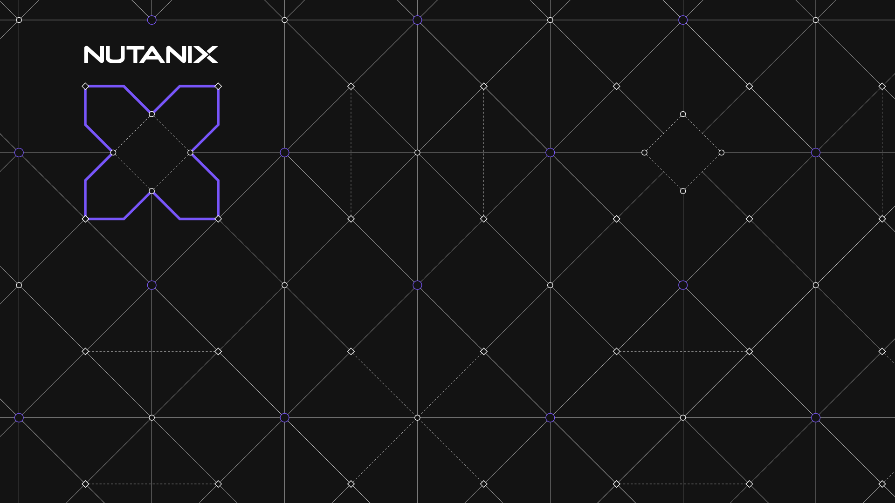

# Heading1

This is where I will write my intro.

## Heading 2

This is **where** I will ramble a bit more

Please go [here](https://www.facebook.com) to read more about my life
### Heading 3

This wi where I  will tell my story and bore everyone to death




execute the following commands

```bash
ls -ltrh
```

``` { python .no-copy }
s = "Python syntax highlighting"
print s
```

```powershell
Get-Date
```

```yaml
metadata:
  name: gary
  namespace: default
```

1. this is step 1
2. this is step 2
5. this is step 3
---

- this point 1
- this is point 2

???note 
       This is a note

!!!info
        This is information

        Please go [here](https://www.facebook.com) to read more about my lif

???tip "Do you like tips?" 
       This is a tip