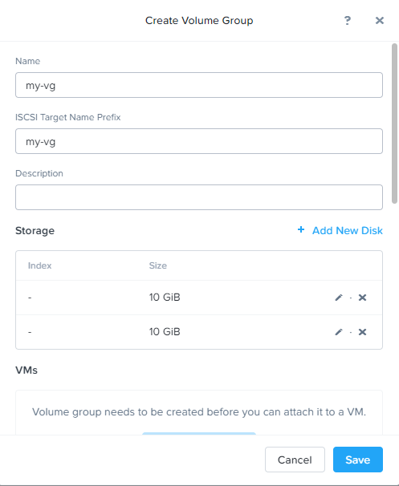

# Volumes

In this section, we will create a Nutanix Volume and then using Windows VM to connect to the volume using iSCSI protocol.

## Volumes Setup

### Check iSCSI Data Service IP
1. Click the Cluster name in the upper left hand corner to check the iSCSI data service IP

2. Close Cluster Details and proceed to Configure Guests

### Get the iSCSI iqn name from WinToolsVM

1. Login to **initials-WinToolsVM** on your cluster with username "administrator" and your password. Click **Windows icon** from bottom left corner. Click the Search icon and enter **iscsi**. Click **iSCSI Initiator**.
    
    
   
2. Click **Yes** to start iSCSI service 
    
    

3. Click the **Configuration** tab to find the **Initiator Name** as the iqn. Make a note of it for a later step.
    
    
   
### Create a Volume Group (VG)
1. Go to Prism Element, navigate to the Storage Dashboard, click **+ Volume Group** to create a new Volume Group.
   
2. In the Volume Group Window give the volume group a name **Intials-vg**, add 2 new disks and select default container, input size for each of the disk of 10 and click **Add**.

3. Click **Save**.
    

### Connect Volumes Disks to Windows VM

1. Locate the VG you just created in **Storage Dashboard > Table > Volume Group**. Click on the VG and click **Update**. 

2. Under **Client**, click **+ Add New Client**, locate the iqn you identify in your WinToolsVM in **Client IQN/IP Address** and click **Add**. The iqn will be selected to add as client.

    

3. Switch back to your WinToolsVM. In **iSCSI initiator properties** click on the **Targets** tab. Type in the iSCSI Data Service IP Address you found in Prism Element and click **Quick Connect**. You will see the target volume group we previously created. As we created 2 disks in the VG, you will see 2 targets discovered. 

    

4. Click **Connect**.

!!!note 
       Volumes does not require multipath I/O (MPIO) configuration on the client. Volumes provides highly available and high performance access to the iSCSI LUNs to clients natively.

5. Click the WIndows Icon and search for **Create and format hard disk partitions**. Then you will go to **Disk Management MMC**.

6. From here you can see the 2 raw disks you created. You can now put the disks online, initialize, format and assign drive letters to them.
   
       

##Conclusion
As part of the Nutanix Unified Storage family, Nutanix Volumes is an enterprise-class software-defined storage that exposes storage resources directly to guest operating systems or physical hosts using the iSCSI protocol. This lab shows how easy to setup and configure iSCSI connection from client and consume VGs from Nutanix Cloud Platform.