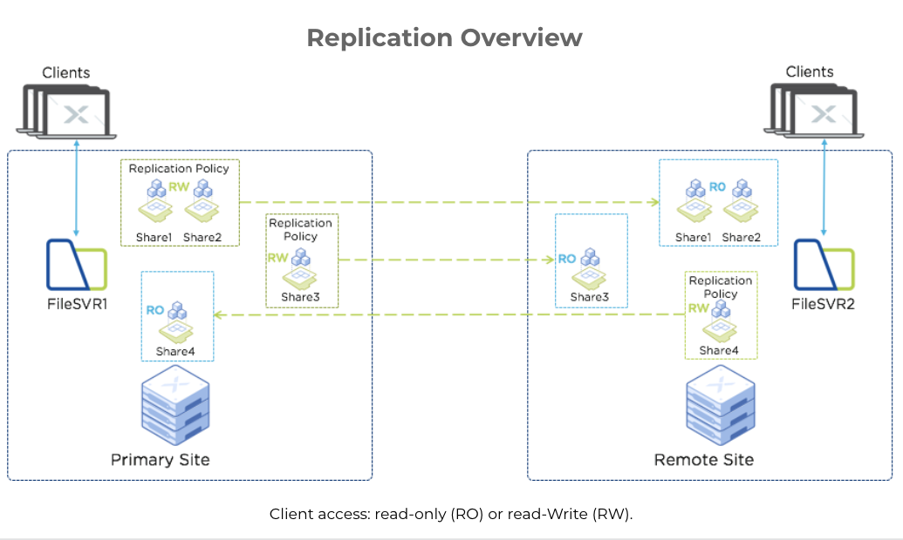
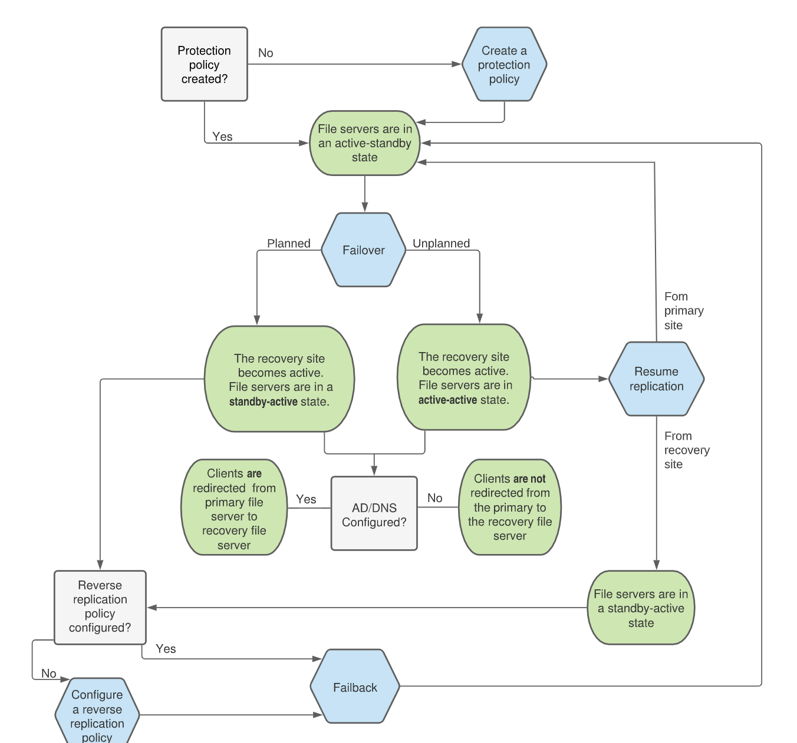

.. _files_replication:

------------------------
Files: Smart DR
------------------------

.. note::

	The estimated time to complete this lab is 60 minutes

Overview
+++++++++

Smart disaster recovery (DR) is a data protection service for Nutanix Files.

Smart DR facilitates share-level data replication and file-server-level disaster recovery. In the event of a planned or unplanned loss of service, you can restore write access to protected shares by failing-over to a recovery site file server. Protection policies indicate failover details, including the primary location, recovery location, and the replication schedule. Rather than having a single protection policy for an entire file server, you can configure unique policies for different shares.

A short recovery time objective (RTO), helps ensure continuous availability of data once you fail over to a recovery site. Configuring Active Directory (AD) and domain name system (DNS) entries facilitates seamless client access redirection.

The following figure gives an overview implementation of Replication in Nutanix Files.

Typical Data Protection Setup for Smart DR
...........................................

The data protection process consists of the following procedures:

- Configuring a Files Protection Policy to replicate share data to a recovery site
- Configuring AD and DNS access for seamless client failover (if AD is different)
- Configuring a reverse replication policy
- Performing a planned or unplanned failover to DR site
- Failing back to the primary site

The following flowchart illustrates the decision making process for a share replication (Smart DR) setup.

Lab Setup
..........

In this lab we will configure replication between of shares between two Files servers on the same HPOC cluster.

Since we are doing this lab on a single HPOC cluster, we will have a single AD domain.

We will do the following:

1. Create a PROD Files server *intials*-fs-prod (1-VM Files Server)
2. Create a DR Files server *intials*-fs-dr (1-VM Files Server)
3. Create a SMB Files share in your PROD Files server and populate the share with sample files
4. Configure Files Protection Policy in Prism Central and replicate
5. Failover, create new files in share and reverse-replicate
6. Failback and check contents

Create PROD Files Server
..........................

#. In **Prism > File Server**, click **+ File Server** to open the **New File Server Pre-Check** dialogue.

#. Click **Continue** on *New File Server: Pre-check* window (if it appeares)

#. Fill out the following fields:

   - **Name** - *intials*-fs-prod (e.g. XYZ-fs-prod)
   - **Domain** - ntnxlab.local
   - **File Server Size** - 1 TiB

#. Click on **Customize**

	 .. figure:: images/customize.png

#. Click **Configure manually**

   .. figure:: images/configure_manually.png

#. Drop-down the **NUMBER OF FILE SERVER VMS** to **1**

   .. figure:: images/no_file_server.png

#. Click on **Save**

#. Select the **Secondary - Managed** VLAN for the **Client Network**.

#. Click **Next**.

#. Select the **Primary - Managed** VLAN for the **Storage Network**.

#. Click **Next**.

#. Fill out the following fields:

   - Select **Use SMB Protocol**
   - **Username** - Administrator@ntnxlab.local
   - **Password** - nutanix/4u
   - Select **Make this user a File Server admin**

   .. figure:: images/createfs_directory_svcs.png

#. Click **Next**.

   By default, Files will automatically create a Protection Domain to take daily snapshots of the Files cluster and retain the previous 2 snapshots. After deployment, the snapshot schedule can be modified and remote replication sites can be defined.

   .. figure:: images/createfs_confirm.png

#. Click **Create** to begin the Files deployment.

#. Monitor deployment progress in **Prism > Tasks**.

   Deployment should take approximately 10 minutes.

   .. figure:: images/createfs_progress.png

Create DR Files Server
..........................

#. Repeat steps 1 - 15 in the previous section to create DR Files Server with the following details:

#. Fill out the following fields(make sure to manually configure Files server to 1 VM):

	 - **Name** - *intials*-fs-dr (e.g. XYZ-fs-dr)
	 - **Domain** - ntnxlab.local
	 - **File Server Size** - 1 TiB

#. Now you should have two Files Servers showing in Prism Element **Prism > File Server**

   .. figure:: images/createfs_twofs.png

Create a SMB Files Share in your PROD Files Server
....................................................

In this section we will create a source files shares to serve as a source and then we will replicate this share subsequently.

#. Click on your Prod Files Server *intials*-fs-prod (e.g. XYZ-fs-prod)

#. Click on **+ Share/Export**

#. Fill in the following details:

   - **Name** - *intials*-prod-share (e.g. XYZ-prod-share)
	 - **Select Protocol** - SMB

	 .. figure:: images/createshare_smb.png

#. Click on **Next**

#. In **Settings** section, select the following:

   - Enable Self Service Restore
	 - Enable File System Compression
	 - Enable Access Based Enumeration (ABE)

	 .. figure:: images/createshare_settings.png

#. Click **Next**

#. Confirm your share settings and click on **Create**

   .. figure:: images/createshare_confirm.png

#. Login to the Windows Tools VM

#. Access your source SMB share *intials*-fs-prod (e.g. XYZ-fs-prod)

#. Open Windows Expolorer with the following credentials:

   - **Username** - administrator@ntnxlab.local
	 - **Password** - nutanix/4u

#. Browse to the location of your 

#. Download the following `Sample Zip file <http://10.42.194.11/workshop_staging/peer/SampleData_Small.zip>`_ and unzip it in your share's Throughout

Configure Files Protection Policy in Prism Central and Replicate
...................................................................

Smart DR feature for Files share replication is activated and maintained in Prism Central. In this section we will configure Smart DR requirements in Prism Central.

#. Logon to Prism Central

#. Click on :fa:`bars` > Services > Files

   .. figure:: images\pc_files.png

#. Click on **Data Protection > Pilices > + New Policy**

#. Select your *intials*-fs-prod (e.g. XYZ-fs-prod) as the **Primary Location (Source File Server)**

   .. note::

   	Selecting the source Files server will automaticall select all the shares within this files server to be protected

#. Select your *intials*-fs-dr (e.g. XYZ-fs-dr) as the **Recovery Location (Target File Server)**

#. Select the **Recovery Point Objective (RPO)** as **10** minutes. (this is the lowest you can set as of now)

   .. note::

		 You can ignore the following warning as the this is just a test for Smart DR feature. In a customer environment the source and Target Files servers will be in different AOS clusters.

		 **xyz-files-dr is on the same AOS cluster as the source. It is recommended to have target file servers on a different AOS cluster.**

#. Make sure your selection looks as follows:

   .. figure:: images/smartdr_policysetup.png

#. Click on **Next** at the bottom of the screen

#. Fill in the following details in **Settings** section

   - **Name** - *intials*-files-repl-policy (e.g. xyz-files-repl-policy)
	 - **Description** - Protection Policy for XYZ Prod to DR Replication (Optional)

#. Click on **Create**

#. Monitor the Events and the policy should show in the **Data Protection > Pilices > + New Policy** in a few minutes

   .. figure:: images\smartdr_policyrpo.png

	 .. note::

	 	Wait a few minutes until all the files are replicated and **RPO Compliant** will have a green-dot to indicate intial synchronization

#. Now return to **Prism Element > Files > Shares/Export** and verify that a replicated share shows in the list

	 .. figure:: images/smartdr_repshare.png

#. Select the replicated share and observe the **Mount Path** in the properties

   .. figure:: images/smartdr_rep_mountpath.png

#. Verify it shows the DR Files Server with the source PROD share (e.g. ``\\xyz-files-dr.ntnxlab.local\xyz-prod-share``)
