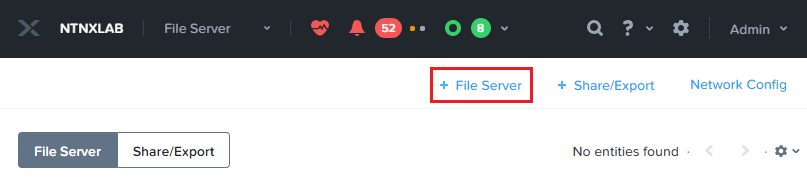
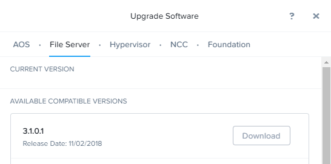

.. _files_replication:

------------------------
Files: Smart DR
------------------------

.. note::

	The estimated time to complete this lab is 60 minutes

Overview
+++++++++

Smart disaster recovery (DR) is a data protection service for Nutanix Files.

Smart DR facilitates share-level data replication and file-server-level disaster recovery. In the event of a planned or unplanned loss of service, you can restore write access to protected shares by failing-over to a recovery site file server. Protection policies indicate failover details, including the primary location, recovery location, and the replication schedule. Rather than having a single protection policy for an entire file server, you can configure unique policies for different shares.

A short recovery time objective (RTO), helps ensure continuous availability of data once you fail over to a recovery site. Configuring Active Directory (AD) and domain name system (DNS) entries facilitates seamless client access redirection.

The following figure gives an overview implementation of Replication in Nutanix Files.

Typical Data Protection Setup for Smart DR
+++++++++++++++++++++++++++++++++++++++++++++++

The data protection process consists of the following procedures:

- Configuring a Files Protection Policy to replicate share data to a recovery site
- Configuring AD and DNS access for seamless client failover (if AD is different)
- Configuring a reverse replication policy
- Performing a planned or unplanned failover to DR site
- Failing back to the primary site

The following flowchart illustrates the decision making process for a share replication (Smart DR) setup.

Lab Setup
+++++++++++++++++++++++++++++++

In this lab we will configure replication between of shares between two Files servers.

Since we are doing this lab on a single HPOC cluster, we will have a single AD domain. We will do the following:

1. Create a PROD Files server *intials*-fs-prod
2. Create a SMB Files share in your PROD Files server and populate the share with sample files
3. Create a DR Files server *intials*-fs-dr
4. Configure Files Protection Policy in Prism Central and replicate
5. Failover and reverse-replicate
6. Failback
