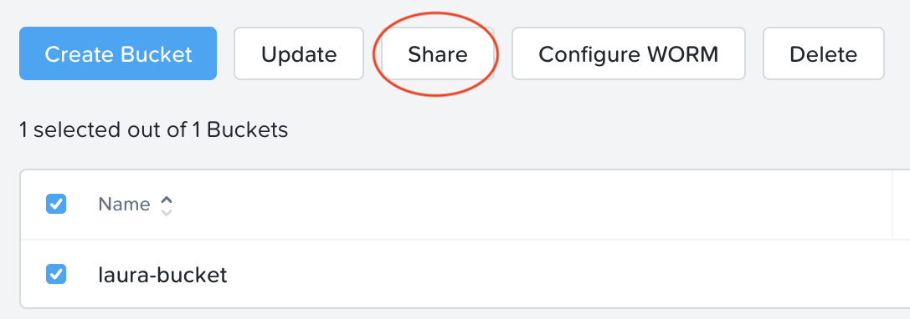
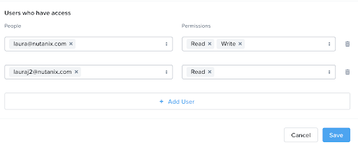
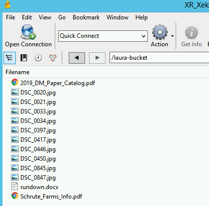
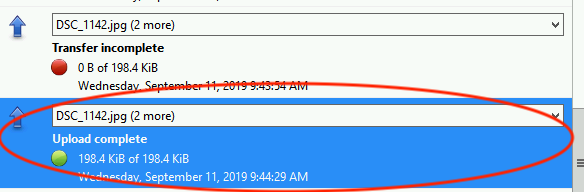

.. _objects_versioning_access_control:

-------------------------------------
Objects: Versioning & Access Controls
-------------------------------------

*The estimated time to complete this lab is 60 minutes.*

Overview
++++++++

Enabling Object Versioning
++++++++++++++++++++++++++

Object versioning allows the upload of new versions of the same object for required changes, without losing the original data. Versioning can be used to preserve, retrieve and restore every version of every object stored within a bucket, allowing for easy recovery from unintended user action and application failures.

#. Return to Cyberduck and re-connect using your user's access and secret keys. If you are already connected, make sure you are on the bucket listing page (the root folder in Cyberduck).

   .. figure:: images/root_folder.png

#. Select your bucket and and click **Get Info**.

   .. figure:: images/buckets_12.png

#. Under the **S3** tab, select **Bucket Versioning** and then close the window. This is equivalent to enabling versioning through Prism.

   .. figure:: images/buckets_13.png

#. Leave the Cyberduck connection open, and open Notepad in *Initials*\ **-Windows-ToolsVM**.

#. Type “version 1.0” in Notepad, then save the file.

#. In Cyberduck, upload the text file to your bucket.

#. Make changes to the text file in Notepad and save it with the same name, overwriting the original file.

#. Upload the modified file to your bucket. Click **Continue** when prompted to overwrite the existing file.

   If desired, you can update and upload the file multiple times.

#. In Cyberduck, click **View > Show Hidden Files**.

   .. figure:: images/buckets_14.png

#. Notice that all versions are shown with their individual timestamps. Toggle **View > Column > Version** to view the version number associated with each object.

   .. figure:: images/buckets_15.png

User Access Control
+++++++++++++++++++

In this exercise we will demonstrate user access controls and how to apply permissions so that other users or applications can access your bucket. For programmatic access to object storage, it is common for each application or service accessing the bucket to have its own access/secret key pair, so that access can be controlled granularly.

.. note::

  You should have two pairs of credentals for this exercise. If you need to generate a key pair, please refer to the **User Management** exercise.

Read Permissions
................

In this exercise we will attempt to list a directory that we don’t have read access to. By default, a new user only has permission to create and view their own buckets, unless given explicit access.

#. Return to Cyberduck and re-connect to the same server using the first set of access and secret keys you used to create a bucket.

.. note::

  Note that you will not see the bucket created using your first user's credentials, even if you had read access to the bucket. This is because the LIST operation to list buckets only shows buckets owned by the authenticated user.

#. Click **Go > Go To Folder** (or Ctrl + G)

#. Enter in the name of the bucket you created in the last exercise. You should receive an Access Denied error.

.. figure:: images/objects_19.png

#. In Prism, within the Objects UI, make sure you are on the Object Stores tab.

#. Click on the name of the object store to view the buckets.

#. Select the bucket you created in the previous exercise by checking the box next to it, then click Share.

#. Click **+ Add User**

#. Enter in the second user’s e-mail you created, and assign it **Read** access.

#. Click Save.

#. Try the operation in Cyberduck again. You should now be able to list the objects in the directory.

Write Permissions
.................

#. Within the same Cyberduck session, right click anywhere in the pane and select **Upload**.

#. Select a different set of images than what has already been uploaded.

#. Click Choose to upload them. You should receive an **Access Denied** error.

#. Click **Cancel**.

#. In Prism, within the Objects UI, make sure you are on the **Object Stores** tab.

#. Click on the name of the object store to view the buckets.

#. Select the bucket you created in the previous exercise by checking the box next to it, then click **Share**.

#. Next to your second user’s name, add the **Write** permission.

#. Click **Save**.

#. Try the operation in Cyberduck again. You should now be able to upload the objects.

Takeaways
+++++++++

What are the key things you should know about **Nutanix Objects**?

- Nutanix Objects provides a simple and scalable S3-compatible object storage solution, optimized for DevOps, Long Term Retention and Backup Target use cases.

- A 2TiB Objects license is included with every AOS cluster. After that, it is licensed by used capacity (as opposed to number of nodes).

- Nutanix Objects can be deployed on an AHV cluster, with ESXi support on the roadmap.

- Nutanix Objects will be enabled and deployed from Prism Central.
